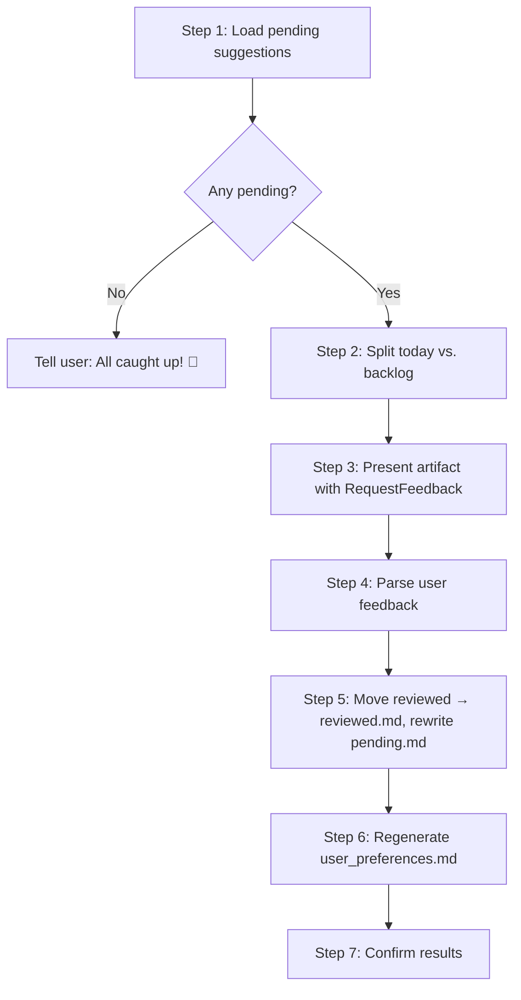

# Review Suggestions Skill

## Overview

The `review-suggestions` skill closes the feedback loop on AI-generated suggestions. It presents pending suggestions from processed reports (newsletters, Threads posts, YouTube videos) as an Antigravity artifact, collects binary Accept/Reject feedback via conversation, and distills the accumulated feedback into a user preference profile that calibrates future AI analysis.

## Problem Statement

The `🏷️ AI 分析` sections in report skills (`newsletter-summary`, `process-delegate-tasks`) generate structured suggestions — next steps, value scores, decision recommendations — but these suggestions were write-only. They were produced at ingestion time and then forgotten. The user had no centralized place to review suggestions, no way to signal whether they were useful, and no mechanism for the AI to learn from past feedback. Over time, suggestions remained generic rather than converging toward the user's actual interests and action patterns.

## Solution

The `review-suggestions` skill introduces a human-in-the-loop feedback cycle that operates entirely within the Antigravity conversation UI — no web dashboard, no database, no extra dependencies.

### Key Features

1. **Centralized Review:** Aggregates all pending suggestions from `data/suggestions_pending.md` into a single numbered artifact, with links to original source articles and full reports.
2. **Today / Backlog Split:** Separates today's suggestions from older unreviewed items, prioritizing fresh content while keeping the backlog accessible.
3. **Binary Feedback:** Accept or Reject — no ambiguous middle ground. Skipped suggestions remain pending. Free-text comments and global preference statements are also captured.
4. **Two-File State Management:**
   - `data/suggestions_pending.md` — shrinks as suggestions are reviewed (items removed).
   - `data/suggestions_reviewed.md` — grows as reviewed items are appended with feedback metadata.
5. **Preference Profile Generation:** After each review session, the skill analyzes all historical feedback and regenerates `data/user_preferences.md` — a Markdown file containing topic affinities, action type preferences, decision calibration ratios, shifting interest flags, and explicit user statements.
6. **Recency-Weighted Conflict Resolution:** Recent feedback (14-day window at 2× weight) overrides older patterns. Explicit user statements always override statistical inference. Conflicts are transparently flagged rather than silently resolved.
7. **Calibration Loop:** Downstream skills (`newsletter-summary`, `process-delegate-tasks`) read the preference profile before generating `AI 分析`, enabling progressively better-calibrated suggestions.

## File Structure

```
review-suggestions/
├── SKILL.md                    # Skill definition and workflow steps
└── README.md                   # This file
```

### Related Data Files

```
data/
├── goals.md                    # User's current goals (read by all AI 分析 skills)
├── suggestions_pending.md      # Unreviewed suggestions (append at ingestion, shrink at review)
├── suggestions_reviewed.md     # Reviewed suggestions with feedback (append-only)
└── user_preferences.md         # Distilled preference profile (regenerated each review)
```

## Triggering

This skill triggers when the user says phrases like:
- "review my suggestions"
- "幫我看建議"
- "check my suggestions"
- "review AI suggestions"

Or any request to review, audit, or provide feedback on AI analysis recommendations.

## Workflow



## Suggestion Entry Format

Each suggestion in `suggestions_pending.md` follows this format:

```markdown
---

### YYYY-MM-DD | {Source Type} | [Title](source_url)
- 🏷️ {分類} | 📊 {total}/6 (A:{n} P:{n} G:{n})
- 📋 建議：{建議下一步}
- 📄 [報告](file:///path/to/report.md)
```

*(Note: Legacy entries using `- 🏷️ {分類} | 💎 {價值評分} | ⚡ {可行動性} | 🎯 {決策建議}` are also parsed and supported.)*

After review, the entry gains feedback metadata in `suggestions_reviewed.md`:

```markdown
- **Feedback**: ✅ Accept / ❌ Reject
- **Comment**: {optional user comment}
- **Reviewed**: {ISO timestamp}
```

## Preference Profile Structure

The generated `data/user_preferences.md` contains:

| Section | Purpose |
|---|---|
| **Summary Statistics** | Total reviewed, accept/reject counts and rates |
| **Topic Preferences** | High-interest vs. low-interest topics (recency-weighted) |
| **Action Type Preferences** | Which suggestion types user acts on vs. avoids |
| **Shifting Interests** | Flagged topics where recent behavior contradicts history |
| **Explicit Preferences** | Direct user statements collected from feedback comments |

## Quality & Precision Guardrails

1. **Binary Signal Only:** Accept and Reject are the only feedback actions. No "Defer" — ambiguous signals pollute preference learning. Skipped suggestions remain pending implicitly.
2. **Recency Wins:** The 14-day window at 2× weight prevents stale preferences from overriding recent behavior shifts.
3. **Explicit Overrides Statistical:** A direct user statement (e.g., "不要再推薦閱讀論文類的建議") always overrides pattern-based inference, regardless of historical accept rates.
4. **Transparent Conflicts:** The profile never silently resolves contradictions. Shifting interests are flagged with both all-time and recent rates.
5. **Append-Only Reviewed Log:** `suggestions_reviewed.md` is append-only — no entries are ever deleted or modified, preserving the full feedback history for preference analysis.

## Dependencies

- `newsletter-summary` skill — appends suggestions to `data/suggestions_pending.md` (Step 2-4b)
- `process-delegate-tasks` skill — appends suggestions to `data/suggestions_pending.md` (Steps 6Tb, 6Yb)
- `rubric-grader` skill — scores, filters, and routes suggestions to pending/filtered; run maintain mode to perform blocklist verification and calibration.

No external tools or CLI dependencies. The skill operates entirely on local Markdown files and the Antigravity artifact UI.

## Architecture Decision Records (ADR)

### ADR-0001: Conversation-Native UI Over Web Dashboard

**Status**: Accepted  
**Date**: 2026-05-07

#### Context
The initial design proposed a local Vite + Express web dashboard for reviewing suggestions. This would require a Node.js server, a frontend build step, and the user to open a browser tab at `localhost:3000`.

#### Decision
Use the Antigravity artifact system (`RequestFeedback: true`) as the review UI and collect feedback via natural-language conversation responses. No web dashboard.

#### Rationale
- **Zero infrastructure**: No server, no build step, no port conflicts.
- **Natural interaction**: The user already works in Antigravity. Opening a separate browser tab breaks flow.
- **Free-text capture**: Conversation allows richer feedback than button clicks — the user can attach comments, state preferences, and provide nuanced signals.
- **Simpler maintenance**: No frontend code to maintain, no API endpoints, no CORS configuration.

#### Consequences
- **Positive**: Dramatically simpler architecture. The entire system is Markdown files + conversation.
- **Negative**: No persistent visual dashboard — the user must trigger "review my suggestions" each time.
- **Risks**: If Antigravity artifact rendering changes, the review format may need adjustment.

### ADR-0002: Two-File State Split (Pending / Reviewed)

**Status**: Accepted  
**Date**: 2026-05-07

#### Context
Multiple storage approaches were considered: a single JSON file, a single Markdown file with status flags, a directory of per-suggestion files, and a two-file Markdown split.

#### Considered Options

| Option | Pros | Cons |
|---|---|---|
| Single JSON file | Easy filter/update | Not human-readable, inconsistent with Markdown ecosystem |
| Single Markdown file | Simple | Read-modify-write on every operation, file grows unbounded |
| Per-suggestion files | Append-only writes, no conflicts | Directory clutter, overhead for small data |
| **Two-file split** | Pending stays small, reviewed is append-only | Rewrite of pending.md at review time |

#### Decision
Split into `suggestions_pending.md` (shrinks at review) and `suggestions_reviewed.md` (append-only).

#### Rationale
- **Ingestion is pure append** to `pending.md` — no read required, no conflicts between concurrent skill runs.
- **Review rewrites `pending.md`** but this is acceptable because: (a) the file is small (only unreviewed items), and (b) the operation is infrequent (user-triggered, not automated).
- **Reviewed is append-only** — the safest possible write pattern. The full history is preserved for preference analysis.
- **All Markdown** — consistent with `goals.md` and `user_preferences.md`, human-scannable, git-diff-friendly.

#### Consequences
- **Positive**: Clean separation of state. Pending file naturally stays small. Reviewed file is the single source of truth for preference extraction.
- **Negative**: Reviewing moves data between files (slightly more complex than toggling a flag).
- **Risks**: If `pending.md` is corrupted mid-review, some suggestions could be lost (mitigated by writing reviewed entries first, then rewriting pending).

### ADR-0003: Binary Feedback (Accept/Reject) Without Defer

**Status**: Accepted  
**Date**: 2026-05-07

#### Context
The initial design proposed three feedback actions: Accept, Reject, and Defer. Defer was intended for suggestions the user was unsure about.

#### Decision
Remove Defer. Use only Accept and Reject. Suggestions not mentioned in the user's response remain pending (implicit deferral).

#### Rationale
- **Clean signal**: Defer is ambiguous — it could mean "maybe later", "I'm unsure", or "I forgot to look at this". None of these provide useful signal for preference learning.
- **Implicit skip**: Not mentioning a suggestion achieves the same effect as Defer without polluting the feedback data.
- **Binary decisions**: Accept/Reject maps directly to "this type of suggestion is useful" vs. "this type is not useful" — the core signal needed for preference calibration.

#### Consequences
- **Positive**: Every feedback entry carries a clear positive or negative signal. Preference profile statistics are unambiguous.
- **Negative**: The user cannot explicitly mark something as "interesting but not now" — they must either accept or skip.
- **Risks**: None material. If the user later wants Defer, it can be added without breaking existing data.

---

## Changelog

| Version | Date | Change Summary |
|---|---|---|
| v1.0.0 | 2026-05-07 | Initial skill: 7-step review workflow with artifact presentation, Accept/Reject feedback collection, two-file state management, and recency-weighted preference profile generation. Integrates with `newsletter-summary` (Step 2-4b) and `process-delegate-tasks` (Steps 6Tb, 6Yb) for suggestion ingestion. See ADR-0001, ADR-0002, ADR-0003. |
| v2.0.0 | 2026-06-11 | Integrated `rubric-grader` skill support. Parsers support dynamic formats (legacy `💎 | ⚡ | 🎯` and new `📊`). Removed Decision Calibration from preference profiling and added `rubric-grader` (maintain mode) invocation. |
