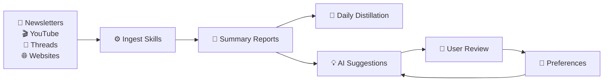
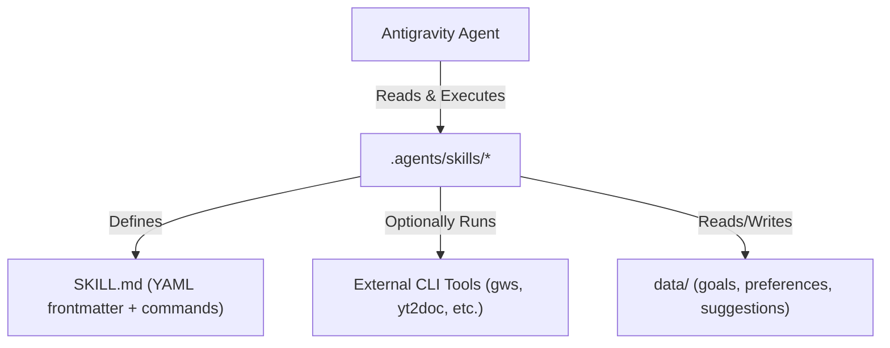
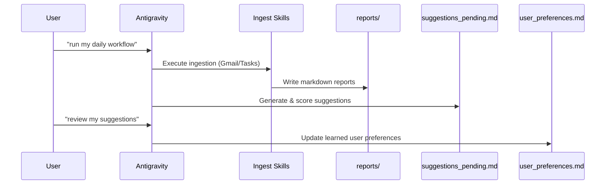

# 🧠 Knowledge Loop

**Supercharge your daily reading. Turn newsletters, videos, and articles into a personalized, self-improving knowledge pipeline.**

Knowledge Loop is an AI-powered personal content intelligence pipeline (designed for [Antigravity](https://antigravity.google/)). It automates daily knowledge digestion — ingesting newsletters, YouTube videos, social media posts, and web articles — then summarizing, distilling, and surfacing actionable insights through AI-powered suggestions that continuously learn and improve based on your feedback.

---

## 🌟 What It Does

Knowledge Loop creates a **knowledge loop**: you feed it content sources, it digests and summarizes them, suggests actionable next steps, learns your preferences from your feedback, and gets smarter over time.



### Core Capabilities

| Skill | Description |
| :--- | :--- |
| **📩 Newsletter Digest** | Fetches unread newsletters from Gmail and summarizes them into Markdown reports |
| **🎬 YouTube Transcription** | Transcribes and documents YouTube videos into structured Markdown |
| **🧵 Threads Ingestion** | Extracts full content from Threads posts via browser automation |
| **🌐 Website Ingestion** | Fetches and summarizes web articles via Jina Reader API |
| **🗞️ Daily Distillation** | Synthesizes the day's reports into a Knowledge Distillation document |
| **💡 Suggestion Review** | AI-generated actionable suggestions scored by a rubric grader |
| **📧 Gmail Management** | Send, read, and manage Gmail via GWS CLI |
| **✅ Google Tasks** | Manage task lists and tasks for the Delegate workflow |
| **🌐 Browser Automation** | Automate browser tasks: navigation, scraping, screenshots |

---

## 🚀 Getting Started

### ⚡ Quick Start Checklist
If you want to get up and running in 2 minutes:
1. **Clone & Setup**: Clone the repository and install the required third-party skills.
2. **Authorize GWS**: Install `gws` CLI and run auth commands.
3. **Configure Gmail**: Create Gmail label `newsletter` and setup filters.
4. **Configure Tasks**: Create a Google Tasks list named `Delegate`.
5. **Personalize Goals**: Edit your personal goals in [goals.md](data/goals.md).
6. **Trigger Pipeline**: Ask Antigravity: `"run my daily workflow"`.

---

### Step-by-Step Installation

#### 1. Clone or Use Template
Click **"Use this template"** on GitHub, or clone locally:
```bash
git clone https://github.com/<your-username>/knowledge-loop.git
cd knowledge-loop
```

#### 2. Install Node.js
Ensure [Node.js](https://nodejs.org/) (v18+) is installed. This is required to run the skills installer utility (`npx skills`).

#### 3. Install Third-Party Skills
The template includes 13 built-in skills. To install the 5 third-party dependencies:
```bash
npx skills experimental_install
```
This installs: `agent-browser`, `architecture-decision-records`, `gws-gmail`, `gws-shared`, `gws-tasks`.

#### 4. Configure GWS (Google Workspace CLI)
Required for Gmail and Google Tasks automation:
```bash
brew tap googleworkspace/cli
brew install gws
gws auth setup
gws auth login
```

#### 5. Setup External Resources
The pipeline needs specific external resources to run correctly:

##### A. Gmail `newsletter` Label & Filters
The `ingest-newsletter` skill processes unread emails with the `newsletter` label (`label:newsletter is:unread`).
* **Web UI (Recommended for auto-routing):**
  1. Open Gmail.
  2. Click **Create new label** in the left sidebar and name it `newsletter` (case-sensitive).
  3. Create a search filter (e.g. from your favorite newsletter senders) and check **Apply the label: `newsletter`** (and optionally **Skip the Inbox**).
* **CLI (Label creation only):**
  ```bash
  gws gmail users labels create \
    --params '{"userId": "me"}' \
    --json '{"name": "newsletter", "labelListVisibility": "labelShow", "messageListVisibility": "show"}'
  ```

##### B. Google Tasks `Delegate` List
The `daily-workflow` skill looks for a task list named `Delegate` to find URLs (YouTube, Threads, Websites) to ingest.
* **CLI (Recommended):**
  ```bash
  gws tasks tasklists insert --json '{"title": "Delegate"}'
  ```
* **Web UI:**
  Open Gmail/Calendar side panel, click **Tasks** -> **Create new list** -> name it `Delegate` (case-sensitive).

#### 6. Customize Your Settings
1. **Edit** [goals.md](data/goals.md) — Define your personal goals to calibrate suggestion scoring.
2. **Edit** [rubric_blocklist.md](data/rubric_blocklist.md) — Add topics you want auto-filtered from suggestions.
3. **Add prompts** to `data/prompts/` — Fill in the template files or add your own.

---

## 🛠️ Usage

Trigger skills by typing natural language commands in your Antigravity chat:

| Trigger phrase | Skill invoked |
| :--- | :--- |
| "summarize my newsletters" | `ingest-newsletter` |
| "run my daily workflow" | `daily-workflow` |
| "distill today's reports" | `daily-distiller` |
| "fetch this Threads post: \<url\>" | `ingest-threads` |
| "transcribe this YouTube video: \<url\>" | `ingest-youtube` |
| "summarize this page: \<url\>" | `ingest-website` |
| "review my suggestions" | `review-suggestions` |

### Daily Workflow Execution
The `daily-workflow` skill chains the entire pipeline in an optimized async/sync order:
1. Discover tasks from the Google Tasks `Delegate` list.
2. Fire YouTube transcriptions asynchronously in the background.
3. Process unread newsletters from Gmail.
4. Process Threads posts.
5. Process Website articles.
6. Await and complete YouTube transcription tasks.
7. Run daily knowledge distillation.
8. Review AI suggestions.

---

## 🏗️ Developer & Architecture Guide

Knowledge Loop is designed around a **Modular, Skill-Based Agentic Architecture** built explicitly for Google's Antigravity agent.

### 📐 System Architecture

Instead of traditional monolithic code, the agent operates directly on **Skills**. A skill is a self-contained bundle consisting of:
* A `SKILL.md` file that gives the agent instructions, system prompts, schemas, and commands.
* An optional `README.md` file summarizing features and usage.
* Helper references, scripts, or local testing configurations.



### 🔄 Data & Suggestion Lifecycle



### 🗺️ Developer Knowledge Map

Refer to this map to quickly locate system files and design details:

| Category | File / Path | Purpose |
| :--- | :--- | :--- |
| **Agent Rules** | [AGENTS.md](AGENTS.md) | Coding conventions, strict tool constraints, and workflow guidelines. |
| **Glossary** | [CONTEXT.md](CONTEXT.md) | Definition of project terms like Dreamer, Trace, and Memory Injection. |
| **Skill Logic** | `.agents/skills/` | Source folders of all 13 built-in and third-party skills. |
| **Preferences** | [user_preferences.md](data/user_preferences.md) | Key-value store of user preferences updated via reviews. |
| **Goal Settings** | [goals.md](data/goals.md) | User goals used by the suggestion scoring rubric. |
| **Safety Hooks** | [prevent_dangerous_commands.sh](scripts/hooks/prevent_dangerous_commands.sh) | Hook executing before command runs to prevent unsafe operations. |
| **Bugs & RCAs** | `docs/rca/` | Post-mortem logs of system errors and their primary root causes. |
| **Decision Logs** | `docs/decision_logs/` | Session logs mapping conversational steps to architectural rationale. |
| **Unified Backlog**| [backlog.md](backlog.md) | Shared tracking document for all pending features and bug fixes. |
| **Settings** | [settings.json](.agents/settings.json) | Global configuration for agent settings and lifecycle hooks. |

---

## 🌐 How to Switch Language

By default, the content summarization pipeline produces output in **English**. To switch to another language (e.g., Traditional Chinese):

1. Edit [user_preferences.md](data/user_preferences.md) — change the `Preferred Output Language` under the `## Configuration` section (e.g., to `Traditional Chinese`).
2. (Optional) Update [rubric_blocklist.md](data/rubric_blocklist.md) — add ambiguity phrases in your target language.

---

## ⚙️ Maintenance & Self-Improvement

* **Lessons learned** are recorded in `learnings/lessons.md` after notable executions.
* **Bugs and unexpected behaviors** are documented as Root Cause Analyses in `docs/rca/` (see [AGENTS.md](AGENTS.md) for RCA requirements).
* **Architectural decisions** follow the ADR format (`architecture-decision-records` skill).
* **Suggestions** build your preference profile over time via the `review-suggestions` skill.

---

## 📄 License

[MIT](LICENSE)
