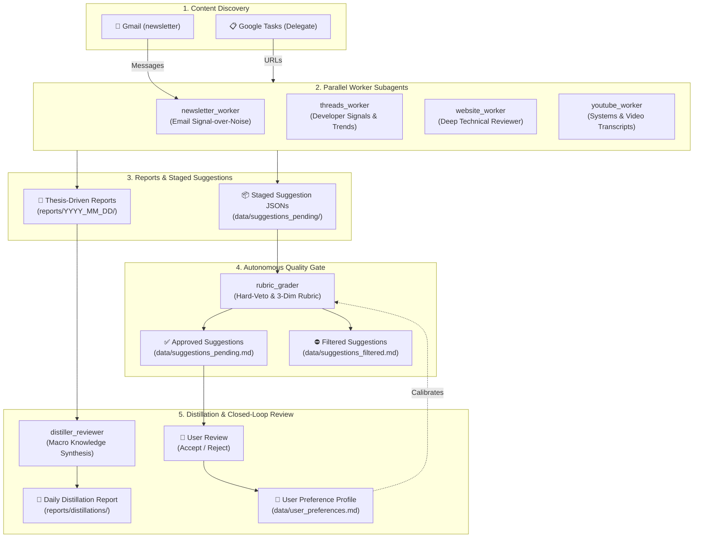

# 🧠 Knowledge Loop

**Supercharge your daily reading. Turn newsletters, videos, and articles into a personalized, self-improving knowledge pipeline.**

Knowledge Loop is an AI-powered personal content intelligence pipeline built for [Google Antigravity](https://antigravity.google/) and cross-platform compatible with **Claude Code** and **OpenAI Codex**. It automates daily knowledge digestion — discovering pending tasks, dispatching parallel worker subagents, extracting high-signal summaries, evaluating suggestions against a 3-dimension rubric, and continuously refining a user preference profile based on your feedback.

---

## 🌟 What It Does

Knowledge Loop creates a continuous, self-improving **knowledge loop**:
1. **Discovers**: Scans Google Tasks (`Delegate` list) and Gmail (`label:newsletter is:unread`).
2. **Digests in Parallel**: Dispatches specialized subagent personas concurrently to ingest newsletters, YouTube videos, Threads discussions, and web articles.
3. **Audits & Grades**: Runs an autonomous quality gate (`rubric_grader`) to filter noise and score suggestions against a strict rubric.
4. **Synthesizes & Learns**: Produces macro knowledge distillations (`distiller_reviewer`) and refines your preference profile as you review recommendations.


```mermaid
graph TD
    subgraph Discovery ["1. Content Discovery"]
        Tasks["📋 Google Tasks (Delegate)"]
        Gmail["📩 Gmail (newsletter)"]
    end

    subgraph ParallelIngest ["2. Parallel Worker Subagents"]
        NW["newsletter_worker\n(Email Signal-over-Noise)"]
        TW["threads_worker\n(Developer Signals & Trends)"]
        WW["website_worker\n(Deep Technical Reviewer)"]
        YW["youtube_worker\n(Systems & Video Transcripts)"]
    end

    subgraph Outputs ["3. Reports & Staged Suggestions"]
        Reports["📄 Thesis-Driven Reports\n(reports/YYYY_MM_DD/)"]
        Staged["📦 Staged Suggestion JSONs\n(data/suggestions_pending/)"]
    end

    subgraph QualityGate ["4. Autonomous Quality Gate"]
        RG["rubric_grader\n(Hard-Veto & 3-Dim Rubric)"]
        Pass["✅ Approved Suggestions\n(data/suggestions_pending.md)"]
        Filter["⛔ Filtered Suggestions\n(data/suggestions_filtered.md)"]
    end

    subgraph Synthesis ["5. Distillation & Closed-Loop Review"]
        DR["distiller_reviewer\n(Macro Knowledge Synthesis)"]
        Distill["🧪 Daily Distillation Report\n(reports/distillations/)"]
        Review["👤 User Review\n(Accept / Reject)"]
        Prefs["🎯 User Preference Profile\n(data/user_preferences.md)"]
    end

    Tasks -->|URLs| ParallelIngest
    Gmail -->|Messages| NW
    ParallelIngest --> Reports
    ParallelIngest --> Staged
    Staged --> RG
    RG --> Pass
    RG --> Filter
    Reports --> DR
    DR --> Distill
    Pass --> Review
    Review --> Prefs
    Prefs -.->|Calibrates| RG
```

---

## 🚀 Getting Started & Setup

> [!IMPORTANT]
> User setup is streamlined so you can be up and running in minutes. Follow this checklist to configure your environment and run your first pipeline.

### ⚡ 2-Minute Quick Start Checklist

1. **Clone & Setup**: Clone this repository and enter the directory.
2. **Install Third-Party Skills**: Run `npx skills experimental_install` (Node.js 18+ required).
3. **Authorize Google Workspace CLI (`gws`)**: Run `gws auth setup` and `gws auth login`.
4. **Configure External Sources**:
   - Create Gmail label `newsletter` and set up auto-filters.
   - Create Google Tasks list named `Delegate`.
5. **Configure Preferences**:
   - Set language preferences in [data/lang_preferences.md](data/lang_preferences.md).
   - Set your goals in [data/goals.md](data/goals.md).
6. **Trigger Your First Run**: Ask your agent: `"run my daily workflow"`.

---

### 📋 Prerequisites

| Tool | Version / Source | Purpose |
| :--- | :--- | :--- |
| **Node.js** | v18+ ([nodejs.org](https://nodejs.org/)) | Required by `npx skills` installer utility |
| **Python** | 3.10+ | Required for validation scripts, subagent syncing, and lifecycle hooks |
| **Google Workspace CLI (`gws`)** | `brew install gws` | CLI for Gmail and Google Tasks automation |
| **yt2doc** | Local CLI ([yt2doc](.agents/skills/yt2doc/SKILL.md)) | Required for YouTube video transcription |

---

### 🛠️ Step-by-Step Installation

#### 1. Clone or Use Template

Click **"Use this template"** on GitHub, or clone locally:

```bash
git clone https://github.com/<your-username>/knowledge-loop.git
cd knowledge-loop
```

#### 2. Install Third-Party Skills

The repository includes 13 built-in skills and synchronizes 5 managed third-party skills tracked in [skills-lock.json](skills-lock.json). Install them with:

```bash
npx skills experimental_install
```

This installs: `agent-browser`, `architecture-decision-records`, `gws-gmail`, `gws-shared`, and `gws-tasks`.

#### 3. Configure Google Workspace CLI (`gws`)

`gws` handles authenticated reading of Gmail messages and Google Tasks:

```bash
# macOS (Homebrew)
brew tap googleworkspace/cli
brew install gws

# Set up OAuth credentials and log in
gws auth setup
gws auth login
```

> [!TIP]
> Refer to [known_issues.md](known_issues.md) if running inside sandboxed environments requiring token refresh or tool escalation.

#### 4. Configure External Ingestion Sources

##### A. Gmail `newsletter` Label & Filter
The `newsletter_worker` processes unread emails with the `newsletter` label (`label:newsletter is:unread`).

* **Web UI (Recommended for auto-routing):**
  1. Open Gmail.
  2. Click **Create new label** in the left sidebar and name it `newsletter` (case-sensitive).
  3. Create search filters for your favorite newsletter senders and check **Apply the label: `newsletter`** (optionally check **Skip the Inbox**).
* **CLI (Label creation only):**
  ```bash
  gws gmail users labels create \
    --params '{"userId": "me"}' \
    --json '{"name": "newsletter", "labelListVisibility": "labelShow", "messageListVisibility": "show"}'
  ```

##### B. Google Tasks `Delegate` List
The master orchestrator looks for a task list named `Delegate` to find URLs (YouTube, Threads, Websites) to ingest.

* **CLI (Recommended):**
  ```bash
  gws tasks tasklists insert --json '{"title": "Delegate"}'
  ```
* **Web UI:**
  Open Gmail or Calendar side panel, select **Tasks** → **Create new list** → name it `Delegate` (case-sensitive).

#### 5. Customize Your Settings & Preferences

1. **Language Settings** — Edit [data/lang_preferences.md](data/lang_preferences.md):
   ```markdown
   # Language Preferences

   - **Preferred Report Language**: English
   - **Preferred Conversation Language**: English
   ```
   *(Supports English, Traditional Chinese, etc. See [Language Configuration](#-how-to-switch-language) below).*
2. **Personal Goals** — Edit [data/goals.md](data/goals.md):
   Define your active learning objectives and architectural priorities to calibrate AI suggestion relevance.
3. **Rubric Blocklist** — Edit [data/rubric_blocklist.md](data/rubric_blocklist.md):
   Add topics, domains, or keywords you want automatically filtered out of AI suggestions.
4. **Prompt Templates** — Inspect [data/prompts/](data/prompts/):
   Customize domain-specific prompts or add new templates as needed.

---

## 💻 Daily Usage

Trigger skills and workflows using natural language directly in your agent chat:

| Trigger Phrase | Invoked Agent / Skill | Action |
| :--- | :--- | :--- |
| **"run my daily workflow"** | `daily-workflow` | Discovers tasks, runs parallel subagent ingestion, grades suggestions, distills knowledge, and triggers review |
| **"summarize my newsletters"** | `newsletter_worker` / `ingest-newsletter` | Fetches unread newsletters from Gmail and creates Markdown reports |
| **"transcribe this YouTube video: \<url\>"** | `youtube_worker` / `ingest-youtube` | Transcribes video via `yt2doc` into structured technical Markdown |
| **"fetch this Threads post: \<url\>"** | `threads_worker` / `ingest-threads` | Scrapes post content, author replies, and discussion trees via browser automation |
| **"summarize this page: \<url\>"** | `website_worker` / `ingest-website` | Fetches and summarizes web articles and tech blogs via Jina Reader API |
| **"distill today's reports"** | `distiller_reviewer` / `daily-distiller` | Synthesizes today's reports in `reports/` into a macro knowledge distillation |
| **"review my suggestions"** | `distiller_reviewer` / `review-suggestions` | Interactively reviews pending suggestions and updates your preference profile |

---

### 🔄 Daily Workflow Execution Pipeline

The `daily-workflow` orchestrator executes an optimized 7-step parallel pipeline:

```
[1. Discover & Classify] ──> [2. Pre-create Directories] ──> [3. Parallel Dispatch]
                                                                      │
[7. Final Summary] <── [6. Review Suggestions] <── [5. Distill Knowledge] <── [4. Collect & Grade]
```

1. **Discover & Classify**: Scans Google Tasks `Delegate` list (routing URLs to Threads, YouTube, or Website queues) and checks Gmail for unread `newsletter` messages. If queues are empty, exits early.
2. **Pre-create Directories**: Sets up date-stamped output folders in `reports/` and initializes `data/suggestions_pending/`.
3. **Parallel Dispatch**: Spawns concurrent, fire-and-forget worker subagents (`newsletter_worker`, `threads_worker`, `website_worker`, `youtube_worker`).
4. **Collect & Rubric Grade Suggestions**: Once workers complete, `rubric_grader` audits staged suggestion JSONs. Items scoring $\ge 4/6$ append to [data/suggestions_pending.md](data/suggestions_pending.md); low-scoring or vetoed items route to [data/suggestions_filtered.md](data/suggestions_filtered.md).
5. **Distill Knowledge**: `distiller_reviewer` synthesizes all processed reports into `reports/distillations/`.
6. **Review Suggestions**: Conducts an interactive review of pending suggestions, updating [data/user_preferences.md](data/user_preferences.md) with accepted and rejected feedback.
7. **Final Summary**: Prints an execution summary covering processed items, generated reports, and graded suggestions.

---

## 🤖 Subagent Personas & Core Capabilities

Knowledge Loop uses a **Declarative Sub-Agent Persona Architecture**. Personas are authored in [.agents/agents/](.agents/agents/) (Single Source of Truth) and automatically synced to **Claude Code** (`.claude/`) and **OpenAI Codex** (`.codex/`) via [scripts/sync_subagents.py](scripts/sync_subagents.py).

### 👥 6-Subagent Persona Roster

| Persona | Role Title | Target Medium | Specialization & Key Directives |
| :--- | :--- | :--- | :--- |
| **`newsletter_worker`** | Signal-over-Noise Email Researcher | Unread Gmail newsletters (`label:newsletter is:unread`) | Aggressively strips out sponsor marketing and promotional fluff; extracts verifiable release notes and technical claims. |
| **`threads_worker`** | Developer Signals & Social Trends Analyst | Threads posts and reply trees (`threads.net`, `threads.com`) | Reconstructs author reply trees and community sentiment; preserves code snippets, GitHub links, and benchmarks. |
| **`website_worker`** | In-Depth Technical Article Reviewer | Technical blogs, RFCs, and documentation | Focuses on trade-off matrices, memory/CPU impacts, and system design patterns; produces structured reasoning maps. |
| **`youtube_worker`** | Systems & Video Transcript Analyst | YouTube tech talks and tutorials (`youtube.com`, `youtu.be`) | Transcribes speech via `yt2doc`; extracts exact benchmarks, hardware specs, and verbal architectures into Mermaid diagrams. |
| **`rubric_grader`** | Autonomous Quality Gate & Hard-Veto Evaluator | Staged suggestions (`data/suggestions_pending/*.json`) | Hard-vetos vague actions ("research more"); matches topics against `rubric_blocklist.md`; scores 3-dimension rubric (Pass $\ge 4/6$). |
| **`distiller_reviewer`** | Principal Knowledge Architect | Daily reports in `reports/` and pending suggestions | Synthesizes macro cross-medium engineering trends in `reports/distillations/`; conducts suggestion reviews and preference calibration. |

---

## 🏗️ Developer & Engineering Standards

### 📐 3-Tier Agent Rules Architecture ([AGENTS.md](AGENTS.md))

Agent behavior is strictly governed by Addy Osmani's 3-Tier hierarchy to eliminate rule drift and preserve attention budget:

- **Tier 1: Always Do (Safe Defaults & Autonomous Automation)**:
  - Automated verification of code/script changes before completion (`What to test`, `How to test`, `Expected behavior`).
  - Validate skills with `python3 scripts/validate_skill.py <path/to/SKILL.md>`.
  - Maintain skill `README.md` with Architecture Decision Records (ADRs) and changelogs.
  - Maintain session registries: check [known_issues.md](known_issues.md) at session start; track improvements in [backlog.md](backlog.md); stage temporary files in `.tmp/`.
  - Use relative workspace links in committed documents (`docs/`, `reports/`, `backlog.md`).
- **Tier 2: Ask First (Human-in-the-Loop & Approval Gates)**:
  - Root Cause Analysis (RCA): For user-reported bugs, pipeline failures, or regressions, document evidence in `docs/rca/` and obtain user approval before implementing fixes.
  - Clarify underspecified requirements and surface trade-offs before writing code.
  - Obtain confirmation before destructive or structural modifications.
- **Tier 3: Never Do (Hard Invariants & Inviolable Boundaries)**:
  - **Tool Circumvention (Fail-Fast)**: Never bypass documented tools in a skill with ad-hoc scripts or unauthorized fallbacks.
  - Never propose manual testing when automated verification is feasible.
  - Never log, print, or commit raw credentials or tokens.
  - Never introduce unrequested features, speculative abstractions, or out-of-scope refactoring.

---

### 📝 Thesis-Driven Report Architecture ([content-summary](.agents/skills/content-summary/README.md))

All ingestion workers produce reports adhering to the Thesis-Driven standard:

1. **Reading Decision Upfront**: Positioned immediately below metadata (`⭐ Reading Decision: ★★★★☆ | Novel Insight | Recommendation`) enabling **<5-second triage** without scrolling.
2. **Two-Zone Rule**:
   - **Zone A (Factual Extraction)**: `TL;DR`, `What Can I Learn From It`, `Core Thesis`, and `Reasoning Map` — zero hallucination, source-faithful factual extraction without personalization.
   - **Zone B (Personalized Judgement)**: `AI Analysis` and actionable next steps — calibrated against [data/goals.md](data/goals.md) and [data/user_preferences.md](data/user_preferences.md).
3. **Reader-Centric Learnings**: `What Can I Learn From It` section placed directly after `TL;DR` for rapid learning extraction.

---

### 🔒 Lifecycle & Safety Hooks ([settings.json](.agents/settings.json))

The agent runtime is fortified with automated hooks:

- **BeforeTool Hooks (`run_command`)**:
  - `prevent_dangerous_commands.sh`: Blocks dangerous commands (destructive deletions, force-pushes, system overrides).
  - `ensure_lang_preferences.sh`: Verifies that [data/lang_preferences.md](data/lang_preferences.md) exists and self-heals corrupted keys.
- **AfterTool Hooks (`replace_file_content`, `write_to_file`)**:
  - Automatically runs `python3 scripts/validate_skill.py && python3 scripts/sync_subagents.py` to keep skills valid and subagents synchronized across platforms.
  - Re-verifies language configuration health.

---

### 🗺️ Developer Knowledge Map

| Category | File / Path | Purpose |
| :--- | :--- | :--- |
| **Agent Steering** | [AGENTS.md](AGENTS.md) | Core 3-tier operational rules and invariants |
| **Multi-Platform Entry** | [CLAUDE.md](CLAUDE.md) | Single-source pointer directing Claude Code to read `AGENTS.md` |
| **Subagent Personas** | [.agents/agents/](.agents/agents/) | Single Source of Truth for sub-agent persona definitions |
| **Sync Script** | [scripts/sync_subagents.py](scripts/sync_subagents.py) | Translates and synchronizes personas to `.claude/` and `.codex/` |
| **Language Config** | [data/lang_preferences.md](data/lang_preferences.md) | Decoupled report and conversation language settings |
| **Personal Goals** | [data/goals.md](data/goals.md) | Strategic learning goals used by rubric grading |
| **Rubric Blocklist** | [data/rubric_blocklist.md](data/rubric_blocklist.md) | Topic and phrase blocklist for auto-filtering suggestions |
| **User Preferences** | [data/user_preferences.md](data/user_preferences.md) | Key-value store of learned preferences updated via reviews |
| **Known Issues** | [known_issues.md](known_issues.md) | Registry of environment failures and workarounds (read at session start) |
| **Unified Backlog** | [backlog.md](backlog.md) | Consolidated tracker for planned features and tech debt |
| **RFCs & Architecture** | [docs/rfc/](docs/rfc/) | Approved system RFCs (3-Tier rules, parallel workers, personas) |
| **Implementation Plans** | [docs/plan/](docs/plan/) | Technical implementation plans and task breakdowns |
| **Root Cause Analyses** | [docs/rca/](docs/rca/) | Quantitative post-mortems and verified remediation logs |

---

## 🌐 How to Switch Language

Language settings are cleanly decoupled into [data/lang_preferences.md](data/lang_preferences.md):

- **Preferred Report Language**: Controls the output language for generated reports, summaries, and knowledge distillations.
- **Preferred Conversation Language**: Controls the language used by the agent in chat, plans, RCAs, and internal technical documentation.

```markdown
# Language Preferences

- **Preferred Report Language**: Traditional Chinese
- **Preferred Conversation Language**: Traditional Chinese
```

*Note: Changes are validated and protected by the `ensure_lang_preferences.sh` lifecycle hook.*

---

## ⚙️ Maintenance & Self-Improvement

- **Environment & Pipeline Quirks**: Recorded in [known_issues.md](known_issues.md) at session start or upon failure.
- **Defects & Regressions**: Handled under the Tier 2 Stop-and-Review gate via formal Root Cause Analyses in [docs/rca/](docs/rca/).
- **Architecture Decisions**: Documented as ADRs in individual skill READMEs and system RFCs in [docs/rfc/](docs/rfc/).
- **Suggestion Calibration**: Every suggestion review dynamically updates the statistical weights in [data/user_preferences.md](data/user_preferences.md).

---

## 📄 License

[MIT](LICENSE)
