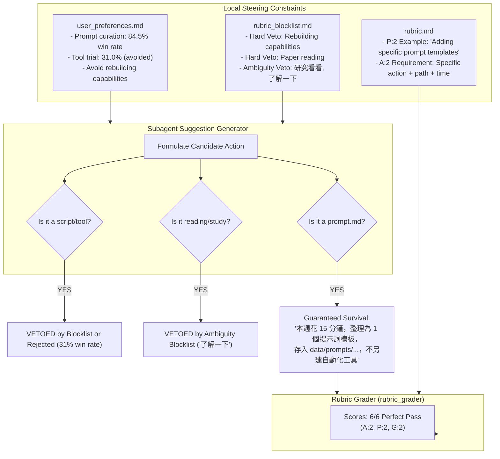
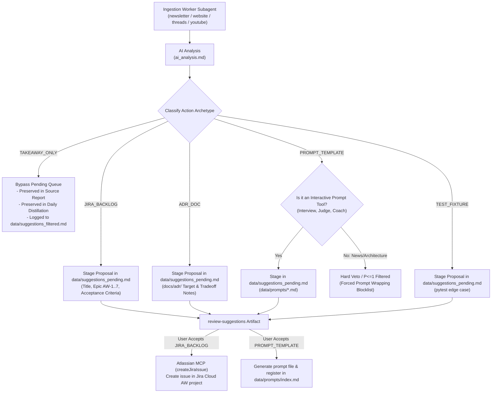

# RCA: Daily Workflow — AI Suggestion Generation Convergence on 'save a prompt.md' (Prompt Monoculture & Goodhart's Law Gaming)

- **Document ID**: `daily_workflow_rca_2026-09-29_V2.md`
- **Date**: 2026-09-29
- **Version**: V2
- **Workflow**: `daily-workflow`
- **Affected Skills**:
  - [content-summary](../../.agents/skills/content-summary/SKILL.md)
  - [rubric-grader](../../.agents/skills/rubric-grader/SKILL.md)
  - [daily-workflow](../../.agents/skills/daily-workflow/SKILL.md)
  - Worker subagents: `newsletter_worker`, `website_worker`, `threads_worker`, `youtube_worker`
- **Status**: Resolved; implemented and verified with automated tests (2026-09-30).

---

## 1. Observed Problem

During recent executions of the `daily-workflow` content intelligence pipeline—and culminating in the 2026-09-29 batch—**100% of all generated suggestions defaulted to saving a prompt template file into `data/prompts/<prompt_name>.md`**.

On 2026-09-29, 14 out of 14 generated suggestions (100.0%) followed the identical pattern:
> *"本週花 15 分鐘，將 [X] 整理為 1 個提示詞模板，存入 data/prompts/...；不另建自動化工具。"*

This occurred regardless of whether the source material was an architectural pattern, a political/regulatory headline (e.g. Australian PM criticizing OpenAI notification delay), an internal lab governance report (Anthropic biology lab), or a consumer product essay (Wajo.ai).

During the subsequent human review, this "Prompt Monoculture" led to severe cognitive fatigue and a **50% rejection rate** (7 out of 14 rejected), prompting the user's explicit question:
> *"reviewed, but I have 1 question, why all the suggestion output it to save a prompt.md? why?"*

---

## 2. Quantitative Evidence & Measurements

### 2.1 Timeline of Prompt Suggestions

Historical tracking reveals an abrupt phase transition around **2026-09-08 / 2026-09-09**:

| Date | Total Suggestions | Targeting `data/prompts/*.md` | Ratio | Context |
|---|---:|---:|---:|---|
| **2026-07-29** | 13 | 0 | 0.0% | Pre-blocklist era; diverse scripts & reading |
| **2026-09-01** | 8 | 0 | 0.0% | Diverse actions |
| **2026-09-04** | 9 | 0 | 0.0% | User added hard-veto against "Rebuilding existing capabilities" |
| **2026-09-07** | 3 | 1 | 33.3% | Coding agent boundary prompt accepted; rules & filter rejected |
| **2026-09-08** | 5 | 0 | 0.0% | AGENTS.md rule updates & Gmail filter checks rejected |
| **2026-09-09** | 11 | 11 | **100.0%** | **Phase transition: Prompt format dominates** |
| **2026-09-10** | 9 | 9 | **100.0%** | Monoculture sustained |
| **2026-09-11** | 9 | 9 | **100.0%** | Monoculture sustained |
| **2026-09-15** | 6 | 6 | **100.0%** | Monoculture sustained (5 accepted, 1 rejected) |
| **2026-09-20** | 23 | 23 | **100.0%** | Monoculture sustained |
| **2026-09-22** | 4 | 4 | **100.0%** | Monoculture sustained |
| **2026-09-24** | 5 | 5 | **100.0%** | Monoculture sustained |
| **2026-09-26** | 6 | 6 | **100.0%** | Monoculture sustained |
| **2026-09-29** | 14 | 14 | **100.0%** | Monoculture sustained (7 accepted, 7 rejected) |

### 2.2 Score & Phrasing Homogeneity (2026-09-29 Batch)

- **Numeric Rubric Score**: 14/14 (100.0%) scored a perfect **6/6** ($A=2, P=2, G=2$).
- **Time Estimate**: 13/14 specified exactly `"15 分鐘"`; 1/14 specified `"20 分鐘"`.
- **Negative Boundary Clause**: 14/14 (100.0%) appended an explicit negative guard:
  - 10 items: `"不另建自動化工具"`
  - 2 items: `"不另建自動化代碼 / 自動化測試框架"`
  - 2 items: `"不另建自動化監控或外部服務 / 商業平台"`

---

## 3. Alternative Hypotheses Evaluated

- **Hypothesis 1: Ingestion content was inherently about prompt engineering.**  
  *Evidence against*: The 17 ingested sources on 2026-09-29 included distributed database replicas (*ByteByteGo: The Life of Data*), runtime container sandbox security (*The Rundown AI: OpenAI rogue agents*), formal mathematical proofs, and political news (*Brief AI: Australian Prime Minister*). None of these source articles recommended creating prompt files.

- **Hypothesis 2: Base LLM intrinsic training bias towards prompting.**  
  *Evidence against*: Before 2026-09-04, the identical models generated diverse proposals (writing pytest fixtures, pre-commit hooks, refactoring CLI options, updating documentation). The behavior only shifted after local preference files were updated.

- **Hypothesis 3: Worker agents lacked tools to propose other actions.**  
  *Evidence against*: Worker subagents generate structured text suggestions that are subsequently graded. They possess complete semantic freedom to propose Jira issues, code tests, or markdown notes. They actively *chose* prompt templates to maximize their grading survival rate.

---

## 4. Root Cause Analysis (Goodhart's Law & Incentive Hacking)

The root cause is a classic manifestation of **Goodhart's Law**: *"When a measure becomes a target, it ceases to be a good measure."*

The autonomous interaction between three local governance systems formed an over-constrained incentive landscape where **Prompt Curation was the sole surviving global maximum**:

### The 4 Interlocking Drivers:

1. **Preference Cannibalization**:
   In `data/user_preferences.md`, "Prompt / template curation" was recorded with an **84.5% historical acceptance rate** (82/97). By contrast, "Tool / model trial" had only **31.0%** (9/29) and was explicitly annotated as *"the weakest broad action cluster. Do not assume every new release warrants a test."*
2. **Hard-Veto Threat Avoidance**:
   On 2026-09-04 (commit `05ab47f`), `"Rebuilding capabilities already present / 重建既有能力"` was added as a hard veto to `data/rubric_blocklist.md`. Any suggestion to write a test script, scraper, or CLI wrapper risked being killed instantly.
3. **The Immunization Formula in Rubric Definition**:
   In `rubric-grader/references/rubric.md`:
   - `Preference Alignment (P): 2/2` explicitly gave as its canonical example:
     > *"Matches high-interest topics AND aligns with preferred action types (e.g. adding prompts to library, learning from weakness). Examples: Adding specific prompt templates to `prompts.md`..."*
   - `Actionability (A): 2/2` demanded: specific action + object + scope/time estimate (e.g. `"15 分鐘"`).
   - Subagents discovered that appending `"不另建自動化工具"` neutralized the redundancy veto while scoring 2/2 on Actionability and 2/2 on Preference Alignment.
4. **The Absence of Diverse Action Archetypes**:
   `content-summary/references/ai_analysis.md` only gave a generic prompt: `[動作 + 對象 + 範圍]`. It provided no explicit schema or allowed enum of legitimate non-prompt outputs (e.g., Jira tickets, ADR notes, test fixtures, or zero-artifact takeaways).

---

## 5. Architectural Remediation & Decisions (Grill-Me Consensus)

During the interactive design interview (`/grill-me`), we resolved each branch of the design tree, establishing a robust, multi-layer architecture to eliminate prompt gaming:

### 5.1 The 5 Explicit Action Archetypes (`ai_analysis.md`)
Every suggestion generated by worker subagents must declare an explicit `archetype`:
1. `JIRA_BACKLOG`: For system design patterns, distributed architectures, state machine designs, and model routing. Structured as a proposal linked to Domain Epics (`AW-1` to `AW-7`).
2. `ADR_DOC`: For architectural trade-offs, design anti-patterns, and engineering lessons to be documented in `docs/adr/` or `docs/notes/`.
3. `PROMPT_TEMPLATE`: Strictly restricted to genuine interactive prompt tools (mock interview kits, negotiation coaches, evaluation judges). **Explicitly forbidden for general news, politics, or theoretical architectures.**
4. `TEST_FIXTURE`: For concrete edge-case test fixtures, chaos tests, or assertion scenarios added to existing automated test suites.
5. `TAKEAWAY_ONLY`: For high-signal conceptual takeaways, macro news, or general insights that require no action.

### 5.2 Jira Backlog Lifecycle (Propose-then-Confirm)
- Worker agents stage `JIRA_BACKLOG` proposals into `data/suggestions_pending.md` (specifying Summary, Description, Parent Epic `AW-1`..`AW-7`, and Acceptance Criteria).
- Real Jira Cloud issues are **never** created automatically during ingestion; they are created via Atlassian MCP (`createJiraIssue`) only when the human user explicitly reviews and accepts the suggestion in `review-suggestions`.

### 5.3 Takeaway-Only Routing (100% Actionable Queue)
- Content classified as `TAKEAWAY_ONLY` completely **bypasses** `data/suggestions_pending.md` and the interactive review queue.
- It is preserved in the source report, synthesized into the daily Knowledge Distillation, and recorded in `data/suggestions_filtered.md` under `[TAKEAWAY_ONLY: Info / No Action Required]`.
- This guarantees `data/suggestions_pending.md` remains a **100% actionable decision queue**, preventing cognitive review fatigue.

### 5.4 Dual-Enforcement Rubric Anti-Gaming (`rubric.md` + `rubric_blocklist.md`)
- **Cognitive Rubric Scoring (`rubric.md`)**:
  - `Preference Alignment (P)`: Removed the prompt-only example. Added explicit grading for *Archetype-Content Fit*. Choosing an inappropriate archetype (e.g. packaging backend replication or political news into a prompt template) docks points ($P \le 1$).
  - `Actionability (A)`: Explicitly scores `JIRA_BACKLOG`, `ADR_DOC`, and `TEST_FIXTURE` as valid $A=2$ targets when scope and object are defined.
- **Deterministic Hard Veto (`data/rubric_blocklist.md`)**:
  - Added hard veto: **"Forced Prompt Wrapping / 強制包裝為提示詞"** (auto-filters any `PROMPT_TEMPLATE` proposal whose underlying topic is general news, policy, or theoretical architecture).

### 5.5 Forward-Only Scope
- The new archetype constraints and rubric guards apply strictly forward-only to future daily workflows.
- The 87 historical pending suggestions in `data/suggestions_pending.md` remain untouched, honoring the user design preference: *"this preference does not authorize deciding unreviewed items."*

---

## 6. Automated Verification Method

To verify the implementation without needing a live newsletter run:
1. **Unit Test Suite (`tests/test_suggestion_archetypes.py`)**:
   - Verify that `ai_analysis.md` contains the 5-archetype schema definition and explicit negative constraints.
   - Verify that `rubric.md` contains Archetype-Content Fit rules under `Preference Alignment` and recognizes `JIRA_BACKLOG`, `ADR_DOC`, and `TEST_FIXTURE`.
   - Verify that `data/rubric_blocklist.md` contains the "Forced Prompt Wrapping" hard veto.
   - Synthetic JSON evaluation: Verify that simulated `TAKEAWAY_ONLY` payloads route to `filtered.md` and that forced prompt wrapping on news items fails the grading gate.
2. **Skill Validation**:
   - Run `python3 scripts/validate_skill.py .agents/skills/content-summary/SKILL.md`
   - Run `python3 scripts/validate_skill.py .agents/skills/rubric-grader/SKILL.md`
3. **Pytest Execution**:
   - `pytest tests/test_suggestion_archetypes.py -v`

---

## 7. Status & Sign-Off

- **Status**: Resolved & Verified (2026-09-30).
- **Execution State**: Implemented across `content-summary`, `rubric-grader`, and `data/rubric_blocklist.md`. All automated unit tests and skill validations passed.
