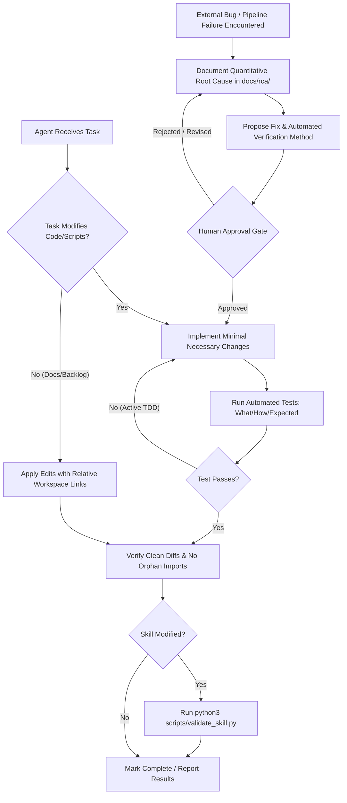

# RFC: 3-Tier Agent Rules Architecture & Attention Budget Governance

## 1. Summary

Restructure the repository's core steering document ([AGENTS.md](../../AGENTS.md)) using Addy Osmani's **3-Tier Agent Rules Architecture** and **Attention Budget Governance**. This refactoring resolves severe semantic redundancies, eliminates unmeasurable aphorisms, establishes clean operational execution boundaries (Always Do / Ask First / Never Do), fixes link portability for GitHub, and achieves a **54% reduction in lines** and **53% reduction in token consumption** without sacrificing safety invariants.

---

## 2. Status

- **Current Status**: Approved & Completed
- **Proposal Date**: 2026-09-03
- **Completed Date**: 2026-09-03
- **Backlog Reference**: [backlog.md](../../backlog.md) Item #63

---

## 3. Motivation

Over successive feature implementations and bug investigations, [AGENTS.md](../../AGENTS.md) grew organically into an unstructured collection of negative constraints, ad-hoc workflow steps, and duplicate admonitions. A systematic audit revealed four major structural defects:

1. **Attention Budget Degradation ("Rule Drift")**:
   - The file accumulated **17 negative prohibitive constraints** (`NEVER`, `DO NOT`, `DON'T`) and **29 restrictive keywords** across 76 lines.
   - Cognitive load research in transformer self-attention indicates that high-density negative suppression rules trigger attention fatigue, increasing the probability that critical system boundaries (such as credential safety or fail-fast tool policies) are dropped during complex multi-step reasoning.
2. **Severe Semantic Duplication (~50% Redundancy)**:
   - Automated testing and manual testing prohibitions were stated across **4 separate sections** (Lines 10, 42–46, 52, 55).
   - Anti-overengineering warnings appeared in 5 distinct sub-bullets and adjacent paragraphs (Lines 20–26).
   - Dead-code preservation rules were repeated in adjacent lines (Lines 31, 34).
   - Root Cause Analysis (RCA) procedures were fragmented across general conventions and project-specific notes.
3. **Host Environment & System Prompt Friction**:
   - An un-scoped prohibition against `file:///` paths created ambiguity with the host AI environment (Antigravity), which requires `file:///` URLs for clickable chat links.
4. **Skill Domain Leakage**:
   - Content summarization standards (such as zero-hallucination processing rules) leaked into global instructions despite existing dedicated skills ([content-summary](../../.agents/skills/content-summary/SKILL.md)).

---

## 4. Detailed Design

### 4.1 Architecture & Governance Model

The refactored rule set organizes all agent instructions into Addy Osmani's 3-Tier hierarchy:

```
┌─────────────────────────────────────────────────────────────────────────┐
│  Tier 1: Always Do (Safe Defaults & Autonomous Automation)              │
│  - Automated test verifications (What to test, How to test, Expected)   │
│  - Skill validation (python3 scripts/validate_skill.py)                 │
│  - Session registries: known_issues.md, backlog.md, .tmp/ staging       │
│  - Minimal code scope, matching style, cleaning orphan imports          │
│  - RFC/Plan template sync & relative markdown links in committed docs   │
├─────────────────────────────────────────────────────────────────────────┤
│  Tier 2: Ask First (Human-in-the-Loop & Approval Gates)                 │
│  - RCA Stop-and-Review gate for external bugs & regressions             │
│  - Clarify ambiguous requirements & surface design trade-offs           │
│  - Destructive changes (deleting pre-existing code, altering schemas)   │
├─────────────────────────────────────────────────────────────────────────┤
│  Tier 3: Never Do (Hard Invariants & Inviolable Boundaries)              │
│  - Tool circumvention (fail-fast on skill tool failures)                │
│  - Proposing manual testing when automated testing is feasible          │
│  - Credential & secret exposure in files or logs                        │
│  - Scope creep (unrequested abstractions, features, or refactoring)     │
└─────────────────────────────────────────────────────────────────────────┘
```

### 4.2 Decision Workflow



### 4.3 Telemetry & Attention Budget Optimization

| Metric | Before Audit | Refactored & Applied | Reduction (%) |
|---|---|---|---|
| **Total Lines** | 76 lines | 35 lines | **-54.0%** |
| **Total Words** | 1,007 words | 423 words | **-58.0%** |
| **Estimated Tokens** | ~1,743 tokens | ~820 tokens | **-53.0%** |
| **Negative Constraints** (`NEVER`, `DO NOT`, `DON'T`) | 17 occurrences | 6 occurrences | **-64.7%** |
| **Total Restrictive Keywords** (`MUST`, `ALWAYS`, `NEVER`, `DO NOT`) | 29 occurrences | 7 occurrences | **-75.9%** |
| **Structure** | Fragmented list | Addy Osmani 3-Tier Architecture | **Standardized** |

### 4.4 File & Module Changes

- **[MODIFY]** [AGENTS.md](../../AGENTS.md) — Replaced 76 lines of flat rules with 35 lines of structured 3-Tier operational governance.
- **[MODIFY]** [CLAUDE.md](../../CLAUDE.md) — Renamed from `CLADE.md` (fixing filename typo) to serve as a lightweight pointer instructing Claude Code to read `AGENTS.md` first.
- **[MODIFY]** [.gemini/config/skills/grill-me/preferences.md](../../.gemini/config/skills/grill-me/preferences.md) — Recorded 4 design preferences learned during the stress-test session.
- **[NEW]** `docs/rfc/3-tier-agent-rules-architecture.md` — This RFC and embedded ADR suite.
- **[MODIFY]** [backlog.md](../../backlog.md) — Marked Item #63 as completed.

---

## 5. Drawbacks & Risks

1. **Risk of Over-Pruning Domain Invariants**:
   - *Risk*: Moving rules out of `AGENTS.md` might lead agents to believe constraints no longer exist when working outside specialized skills.
   - *Mitigation*: Tier 3 preserves hard invariants (credentials, tool fail-fast, scope boundaries), while skill-specific rules remain strictly governed by their respective `SKILL.md` entry points.
2. **TDD Friction vs. RCA Overhead**:
   - *Risk*: An un-scoped RCA requirement halts active development loops whenever a unit test fails.
   - *Mitigation*: Calibrated via ADR-002 so that formal RCAs apply only to user-reported bugs, production/pipeline failures, and functional regressions in existing code.

---

## 6. Alternatives Considered

1. **Alternative A: Retain Flat Monolithic List**:
   - Kept all rules in a single bulleted list and only rephrased wording.
   - *Rejected*: Fails to solve attention degradation and rule drift; leaves the agent without operational clarity on autonomous vs. review-required actions.
2. **Alternative B: Universal Absolute Path Ban (`file:///`)**:
   - Forbid all `file:///` URLs universally, including interactive chat responses.
   - *Rejected*: Breaks the host IDE's clickable navigation links in the chat interface.
3. **Alternative C: Duplicate Rule Files (`AGENTS.md` and `CLAUDE.md`)**:
   - Maintain identical rule content across both files.
   - *Rejected*: Inevitably leads to synchronization drift between tools. Single-source-of-truth pointer is superior.

---

# Architecture Decision Records (ADRs)

---

## ADR-001: Adopt Addy Osmani 3-Tier Agent Rules Architecture

### Context
Steering documents like `AGENTS.md` become cluttered over time, accumulating conflicting negative constraints and diluting the agent's attention budget during complex execution trajectories.

### Decision Drivers
- **Attention Budget**: Minimize token waste on suppression filters to maximize cognitive reasoning bandwidth.
- **Operational Clarity**: Distinguish cleanly between zero-friction automation, mandatory approval checkpoints, and hard system red lines.

### Decisions Made
We adopt Addy Osmani's 3-Tier classification:
1. **Tier 1 (Always Do)**: Autonomous safe defaults (automated test assertions, skill frontmatter validation, registry hygiene in `known_issues.md` and `backlog.md`, `.tmp/` scratch staging).
2. **Tier 2 (Ask First)**: Human-in-the-loop approval gates (RCA fix proposals, ambiguous requirement trade-offs, structural/destructive file changes).
3. **Tier 3 (Never Do)**: Hard system invariants (strict tool enforcement / fail-fast, no manual testing proposals, credential protection, scope creep prevention).

### Consequences
- **Positive**: 54% reduction in lines, 53% reduction in token overhead, zero negative rule drift.
- **Negative**: Requires engineers and agents to categorize future rules into the proper tier rather than appending unstructured bullets.

---

## ADR-002: Bounded RCA Trigger Gate (External/Pipeline/Regression Only)

### Context
The original rule required a full Root Cause Analysis (RCA) document and user approval for *"any bug or unexpected behavior"*. Strictly interpreted, an agent encountering a transient typo or failing assertion during local TDD would be forced to halt, write an RCA markdown file in `docs/rca/`, and block for user approval before fixing the code.

### Decision Drivers
- **Developer Velocity**: Agents must iterate quickly through red-green-refactor cycles during active feature development.
- **Root Cause Discipline**: True system regressions, production pipeline failures, and reported defects must maintain rigorous causal analysis.

### Decisions Made
The Tier 2 RCA Stop-and-Review gate is explicitly bounded to:
1. Bugs reported by the user.
2. Ingestion or daily workflow pipeline crashes.
3. Regressions in existing, previously working functionality.

Iterative unit test failures during active implementation are exempt from triggering an RCA.

### Consequences
- **Positive**: Eliminates workflow paralysis during routine development while preserving high rigor for actual defects and regressions.
- **Negative**: Relies on the agent's honest distinction between active implementation iterations and functional regressions.

---

## ADR-003: Encapsulation of Domain-Specific Rules in Agent Skills

### Context
[AGENTS.md](../../AGENTS.md) previously contained a content summarization directive: *"When summarizing any external content (like emails or newsletters), default to a zero-hallucination processing standard. Do not infer, over-compress, or add external knowledge..."*

### Decision Drivers
- **Domain Decoupling**: Global rules must govern cross-cutting repository behaviors, not domain-specific workflows.
- **Skill Cohesion**: The repository already maintains specialized skills ([content-summary](../../.agents/skills/content-summary/SKILL.md), `ingest-newsletter`, `daily-workflow`) whose explicit job is to enforce Two-Zone factual extraction and zero hallucination.

### Decisions Made
Prune content summarization rules from `AGENTS.md` and keep them fully encapsulated within `.agents/skills/content-summary/SKILL.md`.

### Consequences
- **Positive**: Removes domain instruction leakage from global context; keeps `AGENTS.md` lean.
- **Negative**: Workflows that summarize content without invoking `content-summary` must rely on base model fidelity.

---

## ADR-004: Code vs. Documentation Dual-Track Verification Scope

### Context
Tier 1 mandates automated verification before task completion (`What to test`, `How to test`, `Expected behavior`). Many repository tasks involve non-code artifacts: updating `backlog.md`, writing RFCs, updating prompt templates, or taking notes. Agents were writing throwaway Python scripts to verify simple markdown edits.

### Decision Drivers
- **Meaningful Testing**: Automated tests should verify functional correctness of executable logic, not perform ceremonial checks on prose.
- **Hygiene & Efficiency**: Prevent polluting the workspace with pointless scratch tests.

### Decisions Made
Formally establish a dual-track verification standard:
1. **Executable Code & Scripts (`*.py`, `*.sh`)**: Mandatory automated test verification (pytest, assertions, unit tests).
2. **Agent Skills (`SKILL.md`)**: Mandatory execution of `python3 scripts/validate_skill.py <path/to/SKILL.md>`.
3. **Pure Documentation, Markdown & Backlog**: Verified via structural inspection (valid relative links, correct section formatting) without requiring code test harnesses.

### Consequences
- **Positive**: Eliminates throwaway test generation while maintaining ironclad automated testing for actual logic.
- **Negative**: None.

---

## ADR-005: Scoped Relative Path Enforcement for Committed Markdown Documents

### Context
A blanket rule banning absolute `file:///` paths created a conflict with the host AI environment's clickable link requirements in chat, while unrestrained absolute paths committed to repository markdown files broke portability on GitHub.

### Decision Drivers
- **GitHub Portability**: Markdown documents pushed to remote repositories must have functioning links regardless of machine or checkout directory.
- **Interactive Usability**: Local IDE sessions require clickable links to allow the user to jump directly to referenced files.

### Decisions Made
Scope the relative path prohibition strictly to committed repository documents (`docs/`, `reports/`, `backlog.md`). In interactive chat responses and Brain artifacts, allow the host assistant to use its native clickable link format.

### Consequences
- **Positive**: Committed documentation is 100% portable on GitHub; local chat interaction remains friction-free.
- **Negative**: Agents must maintain awareness of whether they are generating a repo document or a chat message.

---

## ADR-006: Single Source of Truth Multi-Platform Steering via Lightweight Pointer (`CLAUDE.md`)

### Context
Developers may interact with this repository using Antigravity (which reads `AGENTS.md`) or Claude Code (which reads `CLAUDE.md`). A file named `CLADE.md` existed with a typo, preventing detection by Claude Code.

### Decision Drivers
- **Zero Duplication**: Maintaining duplicate rule files creates synchronization lag and rule drift.
- **Tool Interoperability**: Claude Code must discover repository rules without special invocation flags.

### Decisions Made
Rename `CLADE.md` to `CLAUDE.md` and maintain it as a minimal pointer:
```markdown
# CLAUDE.md

Read `AGENTS.md` first, then start working on the project.
```

### Consequences
- **Positive**: Single source of truth in `AGENTS.md` serves both Antigravity and Claude Code seamlessly.
- **Negative**: Claude Code requires an initial tool read of `AGENTS.md` at session start.
