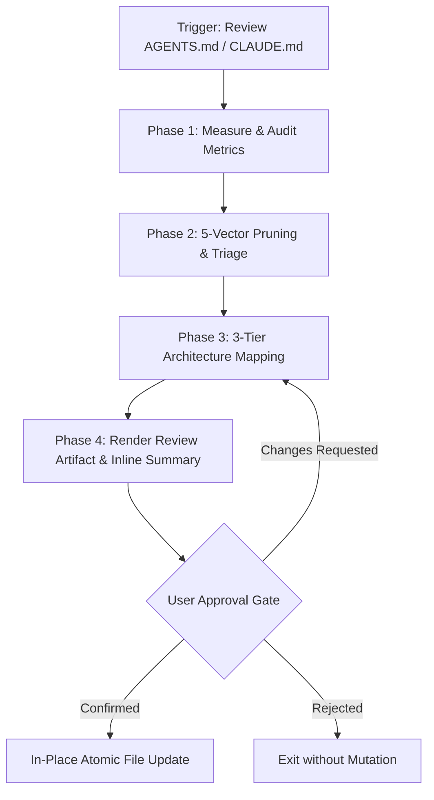

# RFC: Agent Rules Reviewer Skill (`agent-rules-reviewer`)

## 1. Summary

Introduce a dedicated agent skill `agent-rules-reviewer` that automates auditing, streamlining, and refactoring of agent steering files (`AGENTS.md`, `CLAUDE.md`, `.cursorrules`). The skill identifies redundancies, removes baseline LLM knowledge bloat, resolves environment conflicts, and restructures rules into Addy Osmani's **3-Tier Agent Rules Architecture** (Always Do / Ask First / Never Do) with **Attention Budget Governance** (addressing [backlog.md](../../backlog.md) Item #63).

## 2. Status

- **Current Status**: Proposed
- **Proposal Date**: 2026-09-03
- **Last Updated**: 2026-09-03

## 3. Motivation

Agent steering files (such as `AGENTS.md`) tend to accumulate negative micro-rules, duplicate constraints, and ad-hoc instructions over time. A comprehensive audit of this repository's own `AGENTS.md` revealed:

1. **40–50% Semantic Redundancy**:
   - The manual testing ban and automated testing mandate are repeated across **4 separate locations** (Lines 10, 42–46, 52, 55).
   - Anti-overengineering warnings are stated in 3 adjacent paragraphs using different phrasing (Lines 14, 20–25, 26).
   - Dead code preservation rules are duplicated across adjacent sub-bullets (Lines 31, 34).
   - The Root Cause Analysis (RCA) workflow is fragmented between `Conventions` and `Project Specific Instructions`.
2. **Attention Budget Degradation ("Rule Drift")**:
   - Long lists of negative micro-rules (`DO NOT`, `NEVER`, `MUST NOT`) exhaust the LLM's attention budget, ironically increasing the rate of rule violations during complex reasoning tasks.
3. **Environment & System Prompt Tensions**:
   - Instructions forbidding absolute `file:///` links conflict with Antigravity's built-in conversational requirements for clickable links because the scope (persisted docs vs chat responses) is not demarcated.
4. **Baseline Knowledge Bloat**:
   - Standard software engineering aphorisms ("don't make hacky fixes", "never print raw credentials") crowd out project-specific constraints without adding enforcement mechanisms.

By providing a structured, repeatable review skill, any agent session can analyze rule files across projects, provide quantitative attention metrics, and propose 3-tier drop-in replacements via an interactive review gate.

---

## 4. Detailed Design

### 4.1 Architecture & Workflow



### 4.2 The 5-Vector Audit Model

The skill evaluates all existing rules across five distinct vectors:

| Vector | What It Detects | Resolution Heuristic |
|---|---|---|
| **Vector 1: Self-Duplication** | Identical or overlapping rules scattered across multiple sections. | Consolidate into a single canonical tier entry. |
| **Vector 2: Base LLM Baseline** | Generic coding advice or aphorisms that frontier models follow by default (e.g. "don't write hacky code"). | Eliminate or replace with verifiable automated testing gates. |
| **Vector 3: System Conflicts** | Direct contradictions with host environment or built-in system prompts (e.g., clickable UI links vs portable repo paths). | Explicitly scope rule context (e.g., "In committed docs..."). |
| **Vector 4: Skill Domain Leakage** | Deep operational instructions that belong inside a modular `SKILL.md` (e.g., Zero-Hallucination Two-Zone rules belong in `content-summary`). | Reference or delegate to the specialized skill. |
| **Vector 5: Negative Constraint Bloat** | Piles of restrictive `NEVER` / `DO NOT` clauses that can be reframed into positive defaults or concise hard boundaries. | Convert to Tier 1 default behaviors or Tier 3 absolute invariant boundaries. |

### 4.3 3-Tier Agent Rules Architecture

The refactored rule set organizes all surviving directives into three strictly defined tiers:

```
┌─────────────────────────────────────────────────────────────┐
│  Tier 1: Always Do (Safe Defaults & Deterministic Automation)│
│  - Automated test verifications (What, How, Expected)        │
│  - Session start hygiene (read known_issues.md)              │
│  - Skill validation (validate_skill.py)                      │
├─────────────────────────────────────────────────────────────┤
│  Tier 2: Ask First (Human-in-the-Loop & Approval Gates)      │
│  - Architecture changes, RFCs/ADRs, and Plans                │
│  - Surface ambiguities, assumptions, and simpler approaches  │
│  - RCA fix approval before code mutation                     │
├─────────────────────────────────────────────────────────────┤
│  Tier 3: Never Do (Hard Invariants & Inviolable Boundaries)  │
│  - Strict tool enforcement & fail-fast                       │
│  - Scope creep / modifying adjacent code                     │
│  - Committing raw credentials or secrets                     │
└─────────────────────────────────────────────────────────────┘
```

### 4.4 File & Module Changes

```
.agents/skills/agent-rules-reviewer/
├── SKILL.md                          # Lean Spine (<200 lines) defining the 4-stage audit loop
├── references/
│   ├── three_tier_architecture.md    # Addy Osmani 3-Tier specification & Attention Budget rules
│   ├── audit_criteria.md             # 5-vector evaluation guidelines and triage heuristics
│   └── review_template.md            # Standardized template for the review artifact
└── evals/
    └── evals.json                    # 3 benchmark test cases (AGENTS.md, CLAUDE.md, legacy prompt)
```

- **[NEW]** `.agents/skills/agent-rules-reviewer/SKILL.md` — Core instructions (<200 lines) with triggering definitions, execution steps, and interaction protocol.
- **[NEW]** `.agents/skills/agent-rules-reviewer/references/three_tier_architecture.md` — Detailed theoretical and practical guidance for 3-tier rules and attention governance.
- **[NEW]** `.agents/skills/agent-rules-reviewer/references/audit_criteria.md` — Classification rubric for identifying redundancies, base LLM capabilities, and conflicts.
- **[NEW]** `.agents/skills/agent-rules-reviewer/references/review_template.md` — Output schema for generating `agent_rules_review.md` artifacts.
- **[NEW]** `.agents/skills/agent-rules-reviewer/evals/evals.json` — Evaluation dataset with realistic test cases.
- **[NEW]** `tests/test_agent_rules_reviewer.py` — Automated verification suite asserting frontmatter validity, reference file completeness, schema syntax, and Lean Spine budget.

---

## 5. Drawbacks & Risks

1. **Risk of Dropping Nuanced Domain Rules**:
   - *Risk*: Aggressive pruning could inadvertently remove domain-specific rules considered "obvious" by the model.
   - *Mitigation*: The **Propose-then-Confirm** gate ensures the agent produces an interactive Brain Artifact for user inspection before any disk mutation.
2. **Pure LLM Inspection Variance**:
   - *Risk*: Token and line counts estimated by the LLM may vary slightly between runs without a script tokenizer.
   - *Mitigation*: Focus metrics on line counts and percentage reductions; avoid relying on exact token-level assertions.

---

## 6. Alternatives Considered

1. **Option A: Deterministic Helper Script (`scripts/audit_rules.py`)**:
   - *Description*: Bundle a Python script to compute line counts, token estimates, and regex duplicate matches.
   - *Rationale for Rejection*: User explicitly requested a zero-script, pure-LLM approach to avoid increasing project maintenance overhead.
2. **Option B: Inline Chat Output Only**:
   - *Description*: Output the full diff and analysis directly into the conversation stream.
   - *Rationale for Rejection*: User preferred an Artifact (`agent_rules_review.md`) alongside a chat summary to provide a dedicated UI for commenting, reviewing diffs, and discussing details.
3. **Option C: Hardcode to `AGENTS.md` Only**:
   - *Description*: Restrict the skill exclusively to `./AGENTS.md`.
   - *Rationale for Rejection*: User noted that cloud workflows and Claude Code environments rely on `CLAUDE.md`, so multi-platform path flexibility is necessary.

---

# ADR-001: Adopt Addy Osmani 3-Tier Agent Rules Architecture

## Context
Large steering documents (`AGENTS.md`) degrade agent instruction-following performance when filled with scattered, negative micro-rules. Rule drift occurs when models drop high-stakes constraints amidst a sea of minor instructions.

## Decision Drivers
- **Attention Budget**: Maximize model attention on active problem-solving by minimizing prompt bloat.
- **Cognitive Clarity**: Group rules into unmistakable operational tiers rather than mixed paragraphs.
- **Actionability**: Provide clear operational boundaries between what the agent does autonomously vs what requires user sign-off.

## Decisions Made
We adopt Addy Osmani's 3-Tier classification:
1. **Tier 1: Always Do** — Autonomous, non-intrusive safe defaults (testing, validation, directory scans).
2. **Tier 2: Ask First** — Human-in-the-loop review gates (architecture, ambiguous scope, approval gates).
3. **Tier 3: Never Do** — Hard invariant boundaries (secrets, tool enforcement, scope creep).

## Consequences
- **Positive**: Eliminates 40–50% of prompt bloat, removes negative rule clutter, and establishes clear intervention gates.
- **Negative**: Existing unclassified rules must be manually mapped or reviewed during migration.

---

# ADR-002: Zero-Script Pure LLM Inspection Architecture

## Context
We evaluated bundling a dedicated Python script (`scripts/audit_rules.py`) to measure line counts, token sizes, and regex duplicates.

## Decision Drivers
- **Maintenance Overhead**: Minimizing auxiliary scripts in the codebase that require ongoing maintenance.
- **Model Capability**: Frontier LLMs possess sufficient semantic and numerical competence to evaluate rule density and duplications directly.

## Decisions Made
The skill will rely purely on agent LLM inspection and reasoning without auxiliary scripts.

## Consequences
- **Positive**: Zero extra code dependencies or maintenance overhead in `scripts/`.
- **Negative**: Metrics are based on LLM measurement rather than exact byte tokenization.

---

# ADR-003: Propose-then-Confirm Safety Gate via Brain Artifact

## Context
`AGENTS.md` is the fundamental contract governing agent execution. In-place autonomous rewrites risk silent rule deletion or misinterpretation.

## Decision Drivers
- **Blast Radius**: Core steering files must not be mutated without human verification.
- **Review Usability**: Users need a dedicated space to comment on and discuss granular rule changes.

## Decisions Made
The skill operates in an **Audit & Propose** flow. Findings and proposed 3-tier rules are rendered into a persistent Artifact (`agent_rules_review.md`) with an inline chat summary, halting execution until explicit user confirmation is granted.

## Consequences
- **Positive**: High safety, transparent diff inspection, collaborative review experience.
- **Negative**: Requires a two-turn user interaction rather than single-turn automated mutation.

---

# ADR-004: Multi-Platform Rule Scope

## Context
While this repository uses `AGENTS.md`, Claude Code, cloud environments, and Cursor use `CLAUDE.md` or `.cursorrules`.

## Decision Drivers
- **Tool Portability**: Avoid building single-use tools that only function for one file name.
- **Zero Configuration**: Common cases should require no extra arguments.

## Decisions Made
The skill defaults to `./AGENTS.md` when invoked without arguments, but accepts an optional file path argument (e.g. `CLAUDE.md`, custom system prompts).

## Consequences
- **Positive**: Versatile and reusable across projects and environments.
- **Negative**: Requires path resolution and error handling when custom files do not exist.
