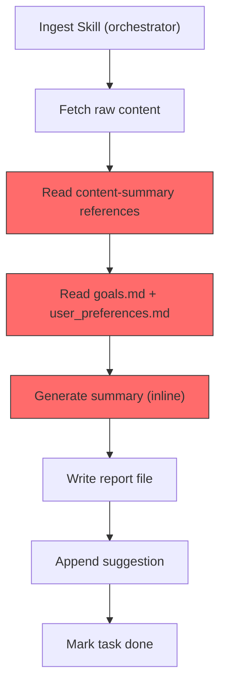
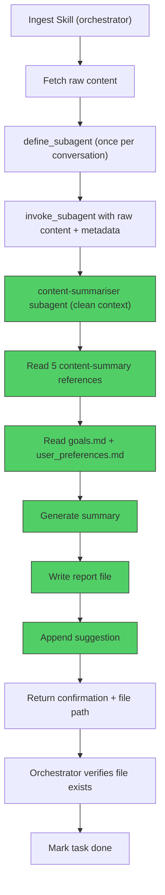

# RFC: Dedicated Summary Subagent for content-summary

## Summary

Introduce a dedicated `content-summariser` subagent (via `define_subagent`) that receives raw content + metadata, independently reads the content-summary reference files and user calibration data, generates the summary report, writes it to disk, and appends a suggestion to the pending backlog. Each ingest skill spawns one fresh subagent per content item, ensuring zero context bleed between items.

## Status

**Proposed** (Approved in Design Grill) — 2026-05-29

## Motivation

The daily content volume has grown to **15–28 reports/day** across 4 source types (Newsletter, Threads, YouTube, Website). During a daily-workflow run, the orchestrating agent accumulates raw content from every source in its context window while performing summarisation inline. As volume continues to grow, this creates **context rot** — earlier content pollutes the context window when summarising later items, risking:

- Lower-quality summaries for items processed later in the batch
- Drifting tone and reduced adherence to the 7-layer framework
- Diluted AI analysis and suggestion calibration

This is a **preventive** measure. Quality has not measurably degraded yet, but the growth trajectory (15 → 28 reports/day and increasing) makes degradation inevitable.

### Current Architecture (Before)



> All steps run in the same agent context. By item #15, the context carries raw content from all previous items.

### Proposed Architecture (After)



> Summarisation happens in an isolated subagent with a fresh context per item. The orchestrator never loads raw content or reference files.

---

## Detailed Design

### 1. Subagent Definition

A custom `content-summariser` subagent is defined via `define_subagent` with the following configuration:

| Parameter | Value |
|---|---|
| `name` | `content-summariser` |
| `enable_write_tools` | `true` |
| `enable_mcp_tools` | `false` |
| `enable_subagent_tools` | `false` |

The system prompt is stored in [subagent_prompt.md](../.agents/skills/content-summary/references/subagent_prompt.md) (new file) and contains:

1. **Role description**: "You are a content summariser for a personal AI workflow pipeline."
2. **File list**: The 7 files to read before summarising (5 references + 2 data files).
3. **Input contract**: What fields the orchestrator provides in the `Prompt`.
4. **Output behavior**: Write report, append suggestion, return confirmation with file path.

### 2. Subagent Lifecycle

**One fresh subagent per content item.** Each invocation gets a completely clean context containing only:
- The lean system prompt (~20 lines)
- The reference files it reads (~10KB total)
- The single piece of raw content to process

After returning the confirmation, the subagent conversation ends.

### 3. Input Contract

The orchestrator sends the following as the subagent's `Prompt`:

```
Source Type: {Newsletter|Threads|YouTube|Website}
Source URL: {url}
Title: {title}
Author: {author}           ← optional; omit if not applicable
Task ID: {task_id}          ← optional; omit for Newsletter
Source Metadata: {type-specific metadata block}
Date: {YYYY-MM-DD}

--- Raw Content ---
{verbatim raw content}
```

### 4. Subagent Execution

The subagent independently:
1. Reads `references/summarise.md`, `references/output_template.md`, `references/ai_analysis.md`, `references/suggestion_log.md`, `references/filename_rules.md`
2. Reads `data/goals.md` and `data/user_preferences.md`
3. Generates the TC summary report following the 7-layer framework
4. Writes the report to `reports/{SourceType}_YYYY_MM_DD/{filename}.md`
5. Appends one suggestion entry to `data/suggestions_pending.md`
6. Returns: `"✅ Report written to reports/{SourceType}_YYYY_MM_DD/{filename}.md"`

### 5. Orchestrator Post-Subagent

After receiving the subagent's confirmation:
1. Verify the report file exists (quick `view_file` or `list_dir`)
2. If confirmed → mark task as done (or mark email as read for newsletters)
3. If no response or error → log warning, skip, do NOT mark as done

### 6. Who Calls `define_subagent`

Each ingest skill is **self-contained**. The SKILL.md instruction says:

> "If `content-summariser` subagent has not been defined in this conversation, read `../content-summary/references/subagent_prompt.md` and use its content as the `system_prompt` parameter to `define_subagent`."

This ensures ingest skills work both within `daily-workflow` and standalone.

### 7. Integration Points

| Skill | What changes |
|---|---|
| `content-summary` | Add `references/subagent_prompt.md`; update SKILL.md table and README |
| `ingest-newsletter` | Replace inline summarise/write/suggest steps with subagent invocation |
| `ingest-threads` | Replace inline summarise/write/suggest steps with subagent invocation |
| `ingest-youtube` | Replace inline summarise/write/suggest steps with subagent invocation |
| `ingest-website` | Replace inline summarise/write/suggest steps with subagent invocation |
| `daily-workflow` | Replace Step 5 inline YouTube summary with subagent invocation |

---

## Drawbacks

- **Subagent overhead**: Each invocation has startup cost (reading 7 files, ~10KB). For 28 items/day, this is ~280KB of redundant file reads. Negligible compared to the summarisation work itself.
- **Latency per item**: Subagent invocation adds round-trip overhead vs. inline processing. Estimated <2s per item.
- **`define_subagent` per conversation**: Must be called once per conversation. Not persistent across sessions.
- **Debugging complexity**: Summarisation errors now occur in a separate subagent conversation, requiring log inspection across conversation boundaries.

---

## Alternatives Considered

- **Use `self` subagent type (no `define_subagent`)**: Always available, zero setup. Rejected because: `self` inherits the full parent system prompt including all skill descriptions, creating risk of accidental skill-trigger matching (e.g., if raw content contains a YouTube URL). Also grants unnecessary tools (MCP, subagent creation, browser). Custom subagent provides least-privilege and focus.

- **Bake reference files into the system prompt**: Concatenate all 5 reference files into `subagent_prompt.md` as a single static file. Rejected because: creates duplication drift — updating `summarise.md` would also require updating the baked prompt. Having the subagent read files at runtime preserves single source of truth.

- **One subagent per batch (send_message loop)**: Spawn one subagent, send items sequentially via `send_message`. Rejected because: the subagent's context accumulates across items within the batch, which is the exact problem we're solving.

- **Orchestrator passes goals/preferences in prompt**: Read `data/goals.md` and `data/user_preferences.md` in the orchestrator and pass them as part of the subagent prompt. Rejected because: the orchestrator has no use for these files — only the subagent needs them for Layer 4–7 synthesis and suggestion calibration. Letting the subagent read them directly is cleaner.

- **Subagent returns text, orchestrator writes files**: Subagent returns structured text with delimiters (`=== REPORT START ===`), orchestrator parses and writes. Rejected because: delimiter parsing is fragile, and since we run one subagent at a time (no concurrent writes), the subagent can safely write directly.

- **Parallel subagent invocations**: Spawn multiple subagents concurrently for batch processing. Deferred as a separate future optimization. Sequential processing is the current model and introducing parallelism adds write contention on `data/suggestions_pending.md`.

---

# ADR: Content-Summariser Subagent Architecture

## Status

Accepted — 2026-05-29

## Context

The content intelligence pipeline processes 15–28 items daily across 4 source types. Summarisation currently runs inline within the orchestrating agent, causing context accumulation across items. As daily volume grows, this risks degrading summary quality for later items in a batch (context rot).

We need an architecture that isolates each summarisation task into a clean context while maintaining the existing quality standards (7-layer framework, Two-Zone rule, user preference calibration).

## Decision Drivers

- **Context isolation**: Each summary must be generated with zero bleed from other items.
- **Single source of truth**: The 5 content-summary reference files must remain the canonical rules — no duplication.
- **Least privilege**: The summariser should have only the tools it needs (read + write), not the full agent toolkit.
- **Standalone compatibility**: Ingest skills must work both within `daily-workflow` and independently.
- **Simplicity**: Minimal changes to existing skill orchestration logic.

## Decisions

1. **Custom subagent via `define_subagent`**: Use a custom subagent type (`content-summariser`) rather than the built-in `self` type, ensuring a focused system prompt with no skill-trigger risk and least-privilege tool access.

2. **One subagent per item**: Spawn a fresh subagent for each content item to guarantee zero context bleed. No batch reuse.

3. **Subagent reads reference files at runtime**: The subagent reads the 5 content-summary reference files and 2 data files itself via `view_file`, rather than having them baked into its system prompt. Preserves single source of truth.

4. **Subagent writes files directly**: The subagent writes the report file and appends the suggestion entry to `data/suggestions_pending.md`. No delimiter-based text parsing needed. Safe because invocations are sequential (no concurrent writes).

5. **Centralized system prompt**: The subagent's system prompt is stored in `content-summary/references/subagent_prompt.md` as a contract-only file (role + file list + I/O contract). Each ingest skill reads this file and passes it to `define_subagent`.

6. **Self-contained ingest skills**: Each ingest skill includes the `define_subagent` step (guarded by "if not already defined"). No dependency on `daily-workflow` running first.

7. **Verify-before-mark invariant**: After subagent completes, the orchestrator verifies the report file exists before marking the task as done. On failure, log and skip.

## Consequences

### Positive
- Each summary gets a pristine context — quality is consistent regardless of batch position.
- Orchestrator context stays lean (only metadata + confirmations, never raw content).
- Reference files remain the single source of truth — no duplication drift.
- Ingest skills remain independently usable outside `daily-workflow`.
- Future parallelism is possible by adding concurrency to `invoke_subagent` calls (separate RFC).

### Negative
- Per-item subagent overhead: ~7 file reads + invocation latency per item. Estimated <2s overhead per item; negligible for 28 items/day.
- Debugging requires inspecting subagent conversation logs rather than the orchestrator's own context.
- `define_subagent` must be called once per conversation — not persistent across sessions.

### Risks
- **Subagent file write race condition**: If future work introduces parallel subagent invocations, concurrent appends to `data/suggestions_pending.md` could corrupt the file.
  - *Mitigation*: Current design is strictly sequential. Parallelism would require a separate file-locking mechanism (deferred to a future RFC).
