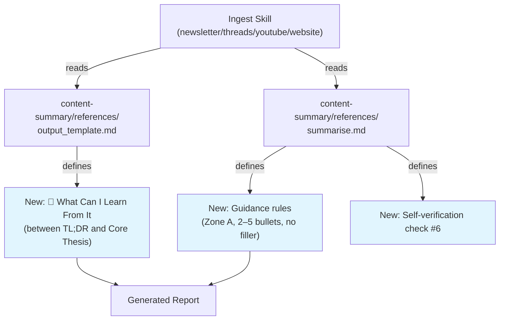

# RFC: Content Summary — Add "What Can I Learn From It" Section

## 1. Summary

Add a new `## 🧠 What Can I Learn From It` section to the standard report output template, positioned between `📝 TL;DR` and `🎯 Core Thesis`. This section distills 2–5 portable, reader-centric learning points from each piece of content, answering "what knowledge do I walk away with?" — distinct from the author-centric Core Thesis.

## 2. Status

- **Current Status**: Approved (Grill Session)
- **Proposal Date**: 2026-08-19
- **Last Updated**: 2026-08-19

**Conversation**: `8bda37dc-a566-4e4b-accb-686b7c45e049`

**Affects**: `content-summary` reference library (`output_template.md`, `summarise.md`) and downstream ingest skills (`ingest-newsletter`, `ingest-threads`, `ingest-youtube`, `ingest-website`).

## 3. Motivation

The current report structure answers three reading questions:

| Question | Section | Perspective |
|---|---|---|
| Should I read this? | ⭐ Reading Decision | Reader (Zone B) |
| What does it say? | 📝 TL;DR | Neutral summary |
| What's the author's argument? | 🎯 Core Thesis | Author-centric |
| How does the author prove it? | 🗺️ Reasoning Map | Author-centric |
| How does this relate to my goals? | 🤖 AI Analysis | Personalized |

**The gap**: No section answers **"What transferable knowledge do I walk away with?"** from the reader's perspective.

### The Problem

`Core Thesis` is author-centric — it reads like a defense brief explaining why the author's position works. This is useful for verifying logical soundness, but it's not what a reader reaches for first. The user's actual reading flow is:

$$\text{Triage} \longrightarrow \text{Context} \longrightarrow \textbf{What do I learn?} \longrightarrow \text{Verify logic (optional)}$$

Example divergence between Core Thesis and learnings:

| | Core Thesis (author) | What Can I Learn (reader) |
|---|---|---|
| Case study article | "Company X succeeded because strategy Y addresses constraint Z" | "Strategy Y works when constraint Z is present; implementation requires steps A, B, C" |
| Research paper | "Our method outperforms baseline by 40% on benchmark B" | "Technique T can improve recall in retrieval pipelines; key insight is chunking at semantic boundaries" |

---

## 4. Detailed Design

### 4.1 Architecture & Workflow

The report generation pipeline remains unchanged. Only the shared template and summarisation rules are updated:



### 4.2 New Report Section Order

```markdown
# {title}
## 來源
## 🔖 來源 Metadata
## ⭐ Reading Decision
## 📝 TL;DR
## 🧠 What Can I Learn From It    ← NEW
## 🎯 Core Thesis
## 🗺️ Reasoning Map
## 🗺️ Visual Map
## 🤖 AI Analysis
## ⚠️ 資訊免責聲明
## 📄 原始內容
```

### 4.3 Section Specification

```markdown
## 🧠 What Can I Learn From It
- [核心學習 1：從這篇內容中可以帶走的最重要知識、技能、方法論或洞察]
- [核心學習 2：第二個關鍵學習點（若有）]
- [核心學習 3–5（若有，每條必須有獨立價值）]
```

**Rules**:
- **Count**: 2–5 bullets. Each must earn its place (no filler, no overlap).
- **Zone**: Zone A (Extraction) — source-faithful only, zero hallucination, no personalization.
- **Quality**: Must be specific knowledge/skill/methodology/insight, not vague topic descriptions.
  - ❌ "了解 AI Agent 的發展趨勢"
  - ✅ "LLM Agent 在多步驟任務中需要結構化記憶回放機制才能維持一致性"
- **Perspective**: Written from reader's viewpoint: "讀完這篇，我學到了什麼？"

### 4.4 File & Module Changes

- **[MODIFY]** `content-summary/references/output_template.md` — Insert new section between `## 📝 TL;DR` and `## 🎯 Core Thesis`.
- **[MODIFY]** `content-summary/references/summarise.md` — Update Zone A table row, add guidance section, add 6th self-verification check.

---

## 5. Drawbacks & Risks

| Risk | Severity | Mitigation |
|---|---|---|
| Overlap with TL;DR | Low | TL;DR summarizes *what the content says*; learnings extract *what the reader takes away*. Guidance explicitly distinguishes the two. |
| Overlap with AI Analysis (Actionability) | Low | AI Analysis is Zone B (personalized to user goals); learnings are Zone A (source-faithful, universal). |
| Report length increase | Low | 2–5 bullets add ~5–10 lines. Marginal compared to existing ~80-line reports. |
| LLM generation quality | Low | Zone A classification + self-verification check #6 enforce concrete, non-vague learnings. |

---

## 6. Alternatives Considered

- **Option A: Enhance Core Thesis to include reader learnings**
  - *Description*: Add a "Reader Takeaways" sub-section under Core Thesis.
  - *Rationale for Rejection*: Core Thesis is author-centric by design. Mixing reader-centric content would blur its purpose and make the section inconsistent.

- **Option B: Add learnings to AI Analysis section**
  - *Description*: Add a "Key Learnings" sub-section under AI Analysis.
  - *Rationale for Rejection*: AI Analysis is Zone B (personalized judgement). Learnings should be Zone A (objective extraction). Placing them in AI Analysis would either compromise their objectivity or break the Two-Zone model.

- **Option C: Place the new section after Reasoning Map (before AI Analysis)**
  - *Description*: Put learnings at the end of the Zone A block, after the reader has seen the full argument chain.
  - *Rationale for Rejection*: User's stated reading flow is "learnings first, then verify logic." Placing after Reasoning Map forces reading the full argument before seeing learnings.

---

# ADR: Content Report Template — "What Can I Learn From It" Design Decisions

### ADR-001: Reader-Centric Learning Section Placement Before Core Thesis

**Status**: Accepted · **Date**: 2026-08-19

**Context**:
The user's reading flow is: triage → context → **learnings** → then optionally verify the author's logic. The existing `Core Thesis` is author-centric (defense-style argumentation) and answers "what's the author's argument?" rather than "what do I learn?" Placing learnings after Core Thesis and Reasoning Map would force the reader to consume the author's full argument chain before discovering what's learnable.

**Decision Drivers**:
- User explicitly stated: "I just want to know what can I learn from it first, then check does it sound logical."
- Reading flow must match user's actual consumption pattern, not academic document ordering.
- TL;DR → Learnings → Thesis creates a natural zoom-in: overview → takeaways → author's reasoning.

**Decisions Made**:
Place `## 🧠 What Can I Learn From It` between `## 📝 TL;DR` and `## 🎯 Core Thesis`.

**Consequences**:
- **Positive**: Learnings are visible within the first screenful after triage; reader can stop after learnings if they don't need to verify the logic chain.
- **Negative**: Zone A sections are no longer in strict "summary → argument → evidence" academic order. Acceptable trade-off for reader UX.

---

### ADR-002: Zone A Classification for Source-Faithful Learnings

**Status**: Accepted · **Date**: 2026-08-19

**Context**:
The Two-Zone model separates report sections into Zone A (zero hallucination, source-faithful extraction) and Zone B (grounded inference anchored to `data/goals.md`). The new "What Can I Learn From It" section could be classified as either zone.

**Decision Drivers**:
- User stated: "I want it to be more coherence to the original content not the personalized content."
- AI Analysis already provides personalized relevance (Zone B). Duplicating personalization would add noise.
- Portable, objective learnings have higher reuse value across contexts.

**Decisions Made**:
Classify as **Zone A (Extraction)**. Learnings must be derived strictly from source content with zero external inference or personalization.

**Consequences**:
- **Positive**: Learnings are universally useful, not tied to current user goals. Self-verification check #6 enforces specificity.
- **Negative**: Some learnings might feel generic without personalization. This is by design — personalization is AI Analysis's job.

---

### ADR-003: Forward-Only Template Migration

**Status**: Accepted · **Date**: 2026-08-19

**Context**:
Hundreds of historical reports exist in `./reports/` without the new section. Retroactive regeneration would require re-running ingest pipelines, risking source unavailability and overwriting manual edits.

**Decision Drivers**:
- Historical reports have already been consumed by the user.
- Daily distillations already synthesize past learnings.
- Source content (Threads posts, newsletters) may no longer be accessible.

**Decisions Made**:
Apply the new section to newly generated reports only. Do not regenerate historical reports.

**Consequences**:
- **Positive**: Zero risk, zero effort on historical content. No git churn.
- **Negative**: Old reports lack the section. Acceptable since they've already been read.
