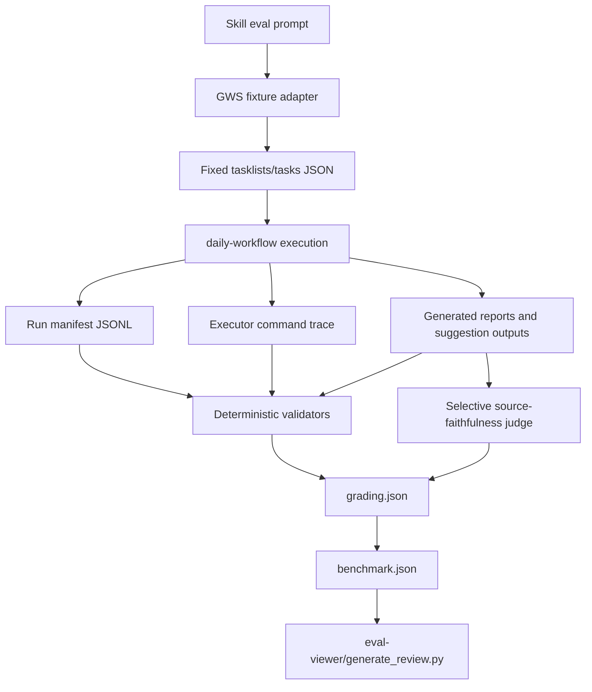

# RFC: Daily Workflow Evaluation Harness

## 1. Summary

Add a regression-safe evaluation system for `daily-workflow` and related ingest
skills. The system uses fixed GWS-shaped fixtures, an eval-only GWS fixture
adapter, run manifests, deterministic validators, and selective LLM-as-judge
checks so workflow behavior can be evaluated without reading or mutating live
Google Tasks.

## 2. Status

- **Current Status**: Proposed
- **Proposal Date**: 2026-06-18
- **Last Updated**: 2026-06-18

## 3. Motivation

The daily workflow now has a clear behavioral checklist, but the checklist is
not yet executable. A human can inspect whether the agent routed tasks
correctly, wrote reports before marking tasks complete, and routed suggestions
through `rubric-grader`, but the project cannot yet run repeatable regression
checks after skill changes.

The hard part is that `daily-workflow` normally discovers work through Google
Tasks:

```bash
gws tasks tasklists list
gws tasks tasks list --params '{"tasklist": "<DELEGATE_LIST_ID>", "showCompleted": false, "maxResults": 100}'
```

Live Google Tasks data changes every day and contains real user tasks. A fixed
evaluation must not depend on that state or mutate it. Otherwise, the same eval
can pass or fail based on today's task list, and a broken eval could complete or
archive real tasks.

This proposal separates deterministic regression evals from live integration
smoke tests:

- **Regression evals** use fixed fixture files that mimic GWS command output.
- **Live smoke tests** verify read-only GWS availability, without task mutation.
- **Run validation** proves the workflow would take the correct actions in the
  correct order.

## 4. Detailed Design

### 4.1 Architecture & Workflow



The eval harness follows the `skill-creator` loop:

1. Store realistic eval prompts in skill-local `evals/evals.json`.
2. Run each prompt with the skill and against a baseline.
3. Grade objective expectations into `grading.json`.
4. Aggregate pass rates, timing, and token usage into `benchmark.json`.
5. Generate the human review artifact with `eval-viewer/generate_review.py`.

### 4.2 Evaluation Modes

| Mode | Purpose | Google Tasks behavior |
|---|---|---|
| Fixture regression mode | Repeatable behavior validation | Never calls live GWS. Reads fixed fixture files. |
| Live smoke mode | Confirm local auth/API availability | Calls read-only `/opt/homebrew/bin/gws tasks tasklists list`. |
| Production mode | Real daily workflow execution | Uses live GWS and may mark tasks complete after reports and suggestions succeed. |

Only fixture regression mode is part of automated regression testing. Live smoke
mode is a separate health check, not a correctness oracle.

### 4.3 Fixture Adapter Contract

Add an eval-only adapter script in the future implementation. The adapter
should mimic the GWS read commands closely enough that the agent still performs
the same parsing and routing work, but without calling Google APIs.

Proposed command shape:

```bash
python3 scripts/daily_workflow_eval_gws.py tasklists.list \
  --fixture-dir .agents/skills/daily-workflow/evals/files/mixed_delegate

python3 scripts/daily_workflow_eval_gws.py tasks.list \
  --fixture-dir .agents/skills/daily-workflow/evals/files/mixed_delegate \
  --tasklist delegate-list-fixture
```

The fixture adapter is not a production fallback. It exists only for evals and
must fail if asked to perform unsupported live mutations.

Example tasklist fixture:

```json
{
  "items": [
    {
      "id": "delegate-list-fixture",
      "title": "Delegate"
    }
  ]
}
```

Example tasks fixture:

```json
{
  "items": [
    {
      "id": "task-threads-1",
      "title": "Process this Threads post",
      "notes": "https://www.threads.net/@user/post/abc"
    },
    {
      "id": "task-youtube-1",
      "title": "Watch this video",
      "links": [{"link": "https://youtu.be/demo123"}]
    },
    {
      "id": "task-website-1",
      "title": "Read article",
      "notes": "https://example.com/article"
    },
    {
      "id": "task-no-url",
      "title": "Think about this later"
    }
  ]
}
```

The fixture format should match observed GWS JSON shape rather than an invented
normalized schema. That keeps evals close to the production command boundary.

### 4.4 Run Manifest Contract

Each eval run should write an audit manifest to `.tmp/`:

```text
.tmp/daily_workflow_runs/YYYY_MM_DD/<eval_id>/run_manifest.jsonl
```

Each line is one JSON event. Required event examples:

```json
{"event":"delegate.discovered","tasklist_id":"delegate-list-fixture","timestamp":"2026-06-18T09:00:00+08:00"}
{"event":"task.classified","task_id":"task-website-1","queue":"website_queue","url":"https://example.com/article","timestamp":"2026-06-18T09:00:01+08:00"}
{"event":"youtube.launched_async","task_id":"task-youtube-1","model":"medium","output_path":"reports/YouTube_2026_06_18/demo123.md","timestamp":"2026-06-18T09:00:02+08:00"}
{"event":"report.written","source_type":"Website","task_id":"task-website-1","path":"reports/Website_2026_06_18/example_com_article.md","timestamp":"2026-06-18T09:01:00+08:00"}
{"event":"suggestion.routed","source_type":"Website","task_id":"task-website-1","route":"pending","score":"5/6","timestamp":"2026-06-18T09:01:10+08:00"}
{"event":"task.completed","task_id":"task-website-1","timestamp":"2026-06-18T09:01:20+08:00"}
{"event":"task.failed","task_id":"task-threads-login-wall","reason":"Threads login wall","timestamp":"2026-06-18T09:02:00+08:00"}
```

Validators should enforce these invariants:

- `task.completed` must occur only after `report.written` and
  `suggestion.routed` for the same task.
- `task.failed` must not be followed by `task.completed` for the same task.
- YouTube jobs must be launched before synchronous newsletter, Threads, and
  Website processing.
- The final summary counts must match manifest events and generated artifacts.
- Eval mode must not contain live GWS mutation events.

### 4.5 Command Trace Contract

The run manifest is necessary but not sufficient. It is produced by the same
agent being evaluated, so it cannot be the only evidence that fixture regression
mode avoided live Google Tasks.

Each eval run should preserve an executor command trace in the skill-creator
workspace:

```text
.agents/skills/daily-workflow-workspace/iteration-<N>/<eval-name>/<configuration>/command_trace.log
```

The exact capture mechanism can be implemented by the future harness, but the
trace must include every shell command the executor attempted during the eval
run. Validators should use it as independent negative evidence.

Fixture regression mode passes the no-live-GWS gate only when both conditions
hold:

1. The manifest contains fixture-adapter events, such as
   `fixture_gws.tasklists_list` and `fixture_gws.tasks_list`.
2. The command trace contains no forbidden live GWS command.

Forbidden commands in fixture regression mode include any live `gws` call,
including Google Tasks and Gmail commands:

```text
gws
/opt/homebrew/bin/gws
gws tasks tasklists list
/opt/homebrew/bin/gws tasks tasklists list
gws tasks tasks list
/opt/homebrew/bin/gws tasks tasks list
gws tasks tasks patch
/opt/homebrew/bin/gws tasks tasks patch
gws tasks tasks update
/opt/homebrew/bin/gws tasks tasks update
gws tasks tasks delete
/opt/homebrew/bin/gws tasks tasks delete
gws gmail
/opt/homebrew/bin/gws gmail
```

The only place live GWS is allowed is the separate live read-only smoke test,
outside fixture regression mode. See ADR-007.

### 4.6 Cross-Environment Command Trace Support

Command traces must be captured outside the evaluated agent's self-reporting
path. Different agentic environments expose different levels of transcript or
tool-call access, so the long-term architecture uses a tiered strategy.

For v1, use the harness-owned command wrapper in every environment. Native
transcript export can be added later as an optimization after the wrapper-based
harness is stable.

| Environment | Native command trace expectation | Supported v1 strategy | Notes |
|---|---|---|---|
| Antigravity | May expose run/tool transcript in the workspace or app UI, depending on execution mode. | Supported through the harness-owned command wrapper. | Native export may become Tier 1 in v2. |
| Claude Code | Often has CLI/subagent transcript context, but machine-readable export may vary by workflow. | Supported through the harness-owned command wrapper. | Avoid implementing transcript normalization in v1. |
| Codex | Tool calls are visible in the session, but may not automatically persist as a file in the eval workspace. | Supported through the harness-owned command wrapper or executor-layer logging. | Do not rely on chat-visible tool calls as persisted artifacts. |

Accepted evidence tiers:

1. **Tier 1 — native transcript export**: the environment provides a
   machine-readable executor/tool-call transcript that can be copied into the
   eval workspace.
2. **Tier 2 — harness-owned command wrapper**: all eval shell commands go
   through a wrapper that logs the command before execution.
3. **Tier 3 — unsupported for no-live-GWS proof**: the evaluated agent writes a
   command summary manually.

Tier 3 is acceptable as debugging context only; it must not be used as proof
that fixture regression mode avoided live GWS. V1 uses Tier 2 in all
environments. See ADR-009 and ADR-010.

### 4.7 Report and Suggestion Validation

Deterministic validators should check:

- Source-specific report directories follow `reports/{SourceType}_YYYY_MM_DD/`.
- Required report metadata and 7-layer sections exist.
- Raw content policy is correct:
  - YouTube and Threads include raw content.
  - Newsletter and Website omit raw content.
- Suggestions are routed through `rubric-grader` to `suggestions_pending.md` or
  `suggestions_filtered.md`.
- The eval run does not manually append a pending suggestion without a rubric
  score.

Source-faithfulness cannot be fully proven with static checks. A selective
LLM-as-judge pass should compare fixture source text against Zone 1 report
sections only:

- Core summary
- Key insight source claim
- Key highlights
- Signal and mechanism sections

The judge should not grade style or taste. It should only answer whether a
claim is supported by the source fixture.

### 4.8 Skill-Creator Compatibility

Each skill eval should follow the schema documented in
`skill-creator/references/schemas.md`:

```json
{
  "skill_name": "daily-workflow",
  "evals": [
    {
      "id": 1,
      "prompt": "Run daily workflow in eval mode using the mixed Delegate fixture. Do not call live GWS or mutate Google Tasks.",
      "expected_output": "A run manifest and generated artifacts showing correct routing, safe completion ordering, and no live Google Tasks mutation.",
      "files": ["evals/files/mixed_delegate/tasklists.json", "evals/files/mixed_delegate/tasks.json"],
      "expectations": [
        "The Delegate task list is discovered from the fixture.",
        "Threads, YouTube, Website, and no-URL tasks are routed correctly.",
        "No task is completed before its report and suggestion routing are recorded.",
        "The eval run does not call live GWS mutation commands."
      ]
    }
  ]
}
```

`grading.json` must use the exact field names required by the viewer:

```json
{
  "expectations": [
    {
      "text": "No task is completed before its report and suggestion routing are recorded.",
      "passed": true,
      "evidence": "Manifest line 8 records report.written, line 9 records suggestion.routed, and line 10 records task.completed for task-website-1."
    }
  ]
}
```

### 4.9 Skill Instruction Boundary

`daily-workflow/SKILL.md` should include only a minimal eval-mode gate. The
skill body should not embed fixture paths, assertion lists, validator command
details, or benchmark workflow mechanics.

The eval-mode gate should be limited to these safety rules:

```markdown
## Eval Mode

Only when the user or eval prompt explicitly says "eval mode":
- Do not call live GWS.
- Use the fixture adapter specified by the eval prompt.
- Do not mutate Google Tasks.
- Write a run manifest for validation.

In normal daily workflow runs, ignore eval mode and use live GWS as documented.
```

All detailed eval mechanics remain outside the production skill body:

| Detail | Location |
|---|---|
| Eval prompts and expectations | `.agents/skills/daily-workflow/evals/evals.json` |
| GWS-shaped fixed inputs | `.agents/skills/daily-workflow/evals/files/` |
| Fixture command behavior | `scripts/daily_workflow_eval_gws.py` |
| Manifest/report/suggestion assertions | `scripts/validate_*.py` |
| Benchmark and human review workflow | `skill-creator` workspace and eval viewer |

This makes eval mode an explicit capability of the skill without turning the
production workflow instructions into a test harness manual. See ADR-006.

### 4.10 V1 Newsletter and Gmail Scope

V1 daily-workflow fixture regression evals should not exercise live Gmail or
full newsletter processing. The orchestrator eval should only verify the
newsletter step boundary:

- The workflow records that the newsletter step was invoked, skipped, or mocked
  in eval mode.
- The command trace contains no live `gws gmail` command.
- No email is marked read, archived, or modified during fixture regression mode.

Full newsletter behavior belongs in separate `ingest-newsletter` evals:

- unread newsletter batch loop
- report-before-archive safety
- no raw-content section
- suggestion routing through `rubric-grader`
- Gmail read/modify command safety

A later integration harness may add a Gmail fixture adapter after the Delegate
task fixture harness is stable. See ADR-008.

### 4.11 File & Module Changes

This RFC proposes the following future implementation work:

| File | Action | Purpose |
|---|---|---|
| `.agents/skills/daily-workflow/evals/evals.json` | New | Skill-creator eval scenarios for the orchestrator. |
| `.agents/skills/daily-workflow/evals/files/` | New | Fixed GWS-shaped fixtures and source content fixtures. |
| `scripts/daily_workflow_eval_gws.py` | New | Eval-only GWS fixture adapter. |
| `scripts/daily_workflow_command_wrapper.py` | New | Optional harness-owned command logger for environments without native transcript export. |
| `scripts/validate_daily_workflow_run.py` | New | Validate manifest ordering, task state, command trace, and summary counts. |
| `scripts/validate_report_structure.py` | New | Validate source-specific report schema and raw-content policy. |
| `scripts/validate_suggestion_routing.py` | New | Validate rubric-based suggestion routing. |
| `.agents/skills/daily-workflow/SKILL.md` | Modify | Document eval mode, fixture adapter usage, and run manifest expectations. |
| `.agents/skills/daily-workflow/README.md` | Modify | Document evaluation workflow and fixtures. |

## 5. Drawbacks & Risks

- **Fixture drift**: GWS output shape may change. Mitigation: keep fixtures based
  on observed GWS JSON and add a read-only live smoke test.
- **Eval mode differs from production**: Fixed fixtures cannot prove live task
  completion works. Mitigation: separate deterministic regression from live
  smoke tests.
- **Run manifest discipline**: Agent-authored manifests can be incomplete.
  Mitigation: validators fail closed when required events are missing.
- **LLM judge cost and variability**: Source-faithfulness checks may add cost and
  non-determinism. Mitigation: use judges only for source-grounding checks that
  static validators cannot prove.
- **Instruction overhead**: Adding eval-mode instructions to `daily-workflow`
  increases skill length. Mitigation: keep `SKILL.md` lean and move details to
  eval files and scripts.

## 6. Alternatives Considered

### Option A: Live GWS regression evals

Run the daily workflow eval against the real Delegate task list.

**Rejected**: Live tasks are unstable and user-owned. The same test would change
daily and could mutate real task state.

### Option B: PATH-level `gws` mock

Shadow `gws` with a mock executable during eval runs.

**Rejected for v1**: This tests the CLI boundary more closely, but it is more
brittle in agent environments and easier to misconfigure. A fixture adapter is
explicit, safer, and easier to audit.

### Option C: Prompt-only fixtures

Tell the agent to inspect fixture files directly without any adapter.

**Rejected**: This is simple, but too far from the production workflow. It does
not exercise the command-shaped boundary where `daily-workflow` normally obtains
task data.

### Option D: Dedicated Google Tasks test list

Create a real test task list and run evals against it.

**Deferred**: This may be useful later for integration tests, but it requires
state cleanup, credentials, and mutation controls. It should not be the first
regression harness.

## 7. Implementation Plan

See [daily-workflow-evals-plan.md](../plan/daily-workflow-evals-plan.md).

---

# ADR-001: Use Fixture Adapter for Fixed GWS Evals

## Status

Proposed — 2026-06-18

## Context

`daily-workflow` discovers work through GWS CLI calls against Google Tasks. The
agent needs to be evaluated against fixed data, but live Google Tasks is mutable
and changes over time. A deterministic eval must avoid live reads and all live
mutations while still resembling the production command boundary.

## Decision Drivers

- Fixed eval input must be repeatable.
- Eval runs must not complete or modify real Google Tasks.
- The agent should still parse GWS-shaped data.
- The harness should be obvious to audit and hard to confuse with production.

## Considered Options

### Option 1: Fixture adapter

Use an eval-only script that emits fixed GWS-shaped JSON for tasklist and task
discovery commands.

- **Pros**: Repeatable, explicit, safe, close to command-shaped production flow.
- **Cons**: Not identical to the real `gws` binary.

### Option 2: PATH-level mock

Shadow the `gws` executable with a mock in eval runs.

- **Pros**: Closer to the production command name.
- **Cons**: Brittle and risky if PATH setup leaks into non-eval runs.

### Option 3: Live GWS

Run evals against real Google Tasks.

- **Pros**: Maximum integration realism.
- **Cons**: Non-repeatable and unsafe for regression tests.

## Decision

Use a fixture adapter for deterministic regression evals. Keep live GWS checks
as separate read-only smoke tests.

## Consequences

### Positive

- Regression evals are stable and safe.
- The fixture payloads remain inspectable and versioned with the skill.
- The adapter can fail closed if asked to mutate Google Tasks.

### Negative

- Does not prove live Google Tasks behavior end to end.
- Fixtures must be refreshed if observed GWS output shape changes.

---

# ADR-002: Use Run Manifest for Workflow Behavior Validation

## Status

Proposed — 2026-06-18

## Context

Many daily workflow criteria are about ordering and state transitions, not just
final files. For example, a task must not be marked complete before a report is
written and a suggestion is routed. Final artifacts alone cannot prove this
ordering.

## Decision Drivers

- Need machine-checkable evidence of workflow order.
- Need to distinguish success, skip, and failure paths.
- Need a lightweight artifact that does not become production state.

## Decision

Each eval run writes a JSONL run manifest under `.tmp/daily_workflow_runs/`.
Validators use the manifest as the source of truth for event ordering,
completion safety, and summary count checks.

## Consequences

### Positive

- Makes behavioral criteria executable.
- Helps diagnose failures without reading the full conversation transcript.
- Keeps transient eval evidence out of permanent report directories.

### Negative

- Requires the agent or harness to write structured events consistently.
- A missing event may represent either a real workflow bug or instrumentation
  failure; validators should fail closed.

---

# ADR-003: Prefer Deterministic Validators Before LLM Judges

## Status

Proposed — 2026-06-18

## Context

The validation checklist includes structural facts, state-ordering facts, and
source-faithfulness judgments. These do not require the same evaluation method.
Using an LLM judge for everything would be slower, more expensive, and less
stable than deterministic checks.

## Decision Drivers

- Prefer repeatable pass/fail checks where possible.
- Reserve model judgment for checks that require semantic comparison.
- Keep eval results easy to debug.

## Decision

Use deterministic scripts for routing, manifest order, report structure, raw
content policy, suggestion routing, and final counts. Use LLM-as-judge only for
source-faithfulness checks that compare fixture source content to report Zone 1
claims.

## Consequences

### Positive

- Lower cost and lower variance.
- Failures point to concrete files, events, or missing fields.
- Source-faithfulness still receives semantic evaluation where needed.

### Negative

- Requires maintaining multiple validators.
- LLM judge integration remains a later, narrower workstream.

---

# ADR-004: Store Skill Regression Evals in Skill-Local `evals/evals.json`

## Status

Proposed — 2026-06-18

## Context

The project already has one skill-local eval file under
`.agents/skills/daily-distiller/evals/evals.json`, and the accepted backlog item
for skill regression calls for `evals/evals.json` under each skill. The
`skill-creator` workflow expects eval prompts, expected outputs, and objective
expectations to live with the skill.

## Decision Drivers

- Align with `skill-creator` best practices.
- Keep evals discoverable from the skill directory.
- Support with-skill vs baseline runs, benchmark aggregation, and review HTML.

## Decision

Place `daily-workflow` eval specs and fixtures under
`.agents/skills/daily-workflow/evals/`. Expand to related skills after the
orchestrator harness is stable.

## Consequences

### Positive

- Eval cases travel with the skill they verify.
- Future skill changes can be evaluated against local regression data.
- Human review can use the standard `eval-viewer/generate_review.py` flow.

### Negative

- Skill directories gain more test artifacts.
- Shared validators must support multiple skill-local fixture directories.

---

# ADR-005: Separate Regression Evals from Live GWS Smoke Tests

## Status

Proposed — 2026-06-18

## Context

A useful test suite needs both deterministic behavior checks and confidence that
the local GWS environment can read Google Tasks. Combining those two concerns
would make regression tests flaky and unsafe.

## Decision Drivers

- Deterministic evals should not require network or credentials.
- Live auth failures should be reported separately from skill behavior failures.
- Live smoke tests must be read-only.

## Decision

Regression evals use fixtures only. Live smoke tests are optional read-only
checks that call `/opt/homebrew/bin/gws tasks tasklists list` and confirm the
Delegate list can be observed.

## Consequences

### Positive

- Skill behavior failures are not confused with auth or network failures.
- Fixed evals can run offline and repeatedly.
- Live checks remain available before real daily workflow execution.

### Negative

- Passing regression evals does not prove live GWS availability.
- Passing live smoke tests does not prove workflow correctness.

---

# ADR-006: Keep a Minimal Eval-Mode Gate in `SKILL.md`

## Status

Proposed — 2026-06-18

## Context

The v1 evaluation target is the agent's behavior when following
`daily-workflow/SKILL.md`, not just deterministic scripts around the workflow.
That means the skill itself needs to recognize an explicit eval-mode request.

At the same time, `daily-workflow/SKILL.md` is a production workflow skill. If
the file contains all fixture paths, validator commands, benchmark steps, and
assertion details, the production instructions become longer, noisier, and
easier for agents to misapply during real daily runs.

The design therefore needs a boundary between:

- **Skill-level safety behavior**: what the agent must do differently in eval
  mode.
- **Harness implementation mechanics**: fixtures, validators, benchmark
  aggregation, and review artifacts.

## Decision Drivers

- The eval must test skill-following behavior, not only prompt override behavior.
- Production daily workflow instructions should remain lean and focused.
- Eval mode must be hard to trigger accidentally.
- Detailed fixture and validator mechanics should be easy to revise without
  editing the production workflow procedure.

## Considered Options

### Option 1: Put eval behavior only in `evals/evals.json` prompts

Eval prompts would tell the agent not to call live GWS and to use fixtures.

- **Pros**: No added complexity in `SKILL.md`.
- **Cons**: Tests prompt override behavior more than skill behavior. A production
  skill reader has no built-in eval-mode safety boundary.

### Option 2: Put the full eval harness in `SKILL.md`

The skill would document fixture paths, adapter commands, validators, manifest
schema, benchmark workflow, and review workflow in detail.

- **Pros**: All eval instructions are visible in one file.
- **Cons**: Pollutes production instructions, increases under/over-trigger risk,
  and makes normal daily workflow execution more cognitively dense.

### Option 3: Minimal eval-mode gate in `SKILL.md`, details outside

The skill only says what changes when eval mode is explicitly requested:
no live GWS, use the specified fixture adapter, no task mutation, write a run
manifest. Detailed fixture and validator mechanics live in eval assets and
scripts.

- **Pros**: Tests skill behavior while keeping production instructions lean.
  Reduces accidental live mutation during evals without overloading the skill
  body.
- **Cons**: Readers must follow references to understand the full harness.

## Decision

Use Option 3. Add a small eval-mode gate to `daily-workflow/SKILL.md` and keep
all detailed harness mechanics in `evals/evals.json`, fixture files, scripts,
and skill-creator workspace artifacts.

The intended `SKILL.md` addition is:

```markdown
## Eval Mode

Only when the user or eval prompt explicitly says "eval mode":
- Do not call live GWS.
- Use the fixture adapter specified by the eval prompt.
- Do not mutate Google Tasks.
- Write a run manifest for validation.

In normal daily workflow runs, ignore eval mode and use live GWS as documented.
```

## Rationale

This preserves the core purpose of the eval: measure whether the agent follows
the daily workflow skill correctly. If eval mode lives only in the prompt, the
skill has no explicit test seam. If every harness detail lives in the skill, the
production instructions become a mixed operational/testing document.

A minimal gate is the narrowest instruction change that makes eval behavior
intentional and safe.

## Consequences

### Positive

- Eval mode is explicit and safe.
- Production `daily-workflow` instructions remain focused.
- Fixture paths, assertions, and validator commands can evolve without bloating
  the skill body.
- The test still evaluates skill-following behavior, not only ad hoc prompt
  compliance.

### Negative

- Implementers must keep eval prompts and scripts aligned with the minimal skill
  gate.
- The full eval design is distributed across the RFC, eval assets, and scripts.

---

# ADR-007: Require Command Trace Validation for No-Live-GWS Guarantees

## Status

Proposed — 2026-06-18

## Context

Fixture regression mode must prove that the agent did not call live Google
Tasks. The run manifest records intended workflow events, but it is
agent-produced evidence. A faulty or noncompliant agent could call live GWS and
omit that command from the manifest.

This is especially important because the highest-risk behavior is external
state mutation:

```bash
gws tasks tasks patch
gws tasks tasks update
gws tasks tasks delete
gws gmail users messages modify
```

If the eval relies only on the manifest, it can verify the story the agent tells
about the run, but not the actual commands the agent attempted.

## Decision Drivers

- No-live-GWS guarantees need evidence independent from the agent-produced
  manifest.
- Fixture regression mode must be safe even when the agent fails to follow the
  eval-mode instructions.
- The validator should distinguish between fixture regression mode and the
  separate live read-only smoke test.

## Considered Options

### Option 1: Trust the run manifest only

The validator checks that no live GWS event appears in `run_manifest.jsonl`.

- **Pros**: Simple and already part of the proposed harness.
- **Cons**: Weak evidence. A buggy agent can omit forbidden commands from the
  manifest.

### Option 2: Trust prompt instructions only

The eval prompt tells the agent not to call live GWS, and the review assumes
compliance.

- **Pros**: No extra harness work.
- **Cons**: Does not detect instruction-following failures, which are exactly
  what the eval is meant to catch.

### Option 3: Validate executor command trace plus manifest

The validator checks positive manifest evidence that fixtures were used and
negative command-trace evidence that no live GWS command was attempted. The
command trace must be captured by the execution environment or harness, not
authored as a manual summary by the evaluated agent.

- **Pros**: Stronger trust model. Catches omitted manifest events and accidental
  live command usage.
- **Cons**: Requires the eval harness to preserve or generate a command trace.

## Decision

Use Option 3. Fixture regression evals must validate both:

1. **Positive fixture evidence** in the run manifest.
2. **Negative live-GWS evidence** in the executor command trace.

The validator must fail fixture regression mode if the command trace contains
any live `gws` command. The live read-only smoke test remains separate and is
the only context where `/opt/homebrew/bin/gws tasks tasklists list` is allowed.

The command trace must come from an external capture path:

- native machine-readable transcript export, or
- a harness-owned command wrapper that logs commands before execution.

An agent-authored `command_trace.log` is not acceptable proof for no-live-GWS
guarantees.

## Rationale

The manifest is useful for workflow state transitions, but it is not a security
or external-side-effect audit log. A command trace gives the validator a second
source of evidence that is closer to what the agent actually executed.

This keeps the core safety claim honest: "fixture regression evals do not call
live GWS" becomes an independently checked property, not just an instruction in
the prompt.

## Consequences

### Positive

- Stronger protection against accidental live Google Tasks reads or mutations
  during fixture evals.
- Better failure diagnostics when an agent violates eval mode.
- Cleaner separation between fixture regression evals and live smoke tests.

### Negative

- The future harness must capture command traces consistently.
- If the execution environment cannot provide a full transcript automatically,
  the implementation must create a command logging convention for eval runs.

---

# ADR-008: Exclude Live Gmail and Newsletter Processing from V1 Orchestrator Evals

## Status

Proposed — 2026-06-18

## Context

`daily-workflow` includes a newsletter step, but newsletter ingestion uses a
different external system boundary from Delegate task discovery:

```bash
gws gmail users messages list
gws gmail +read
gws gmail users messages modify
```

The v1 evaluation design already introduces a fixture adapter for Google Tasks.
Adding full Gmail/newsletter behavior to v1 would require a second fixture
adapter, separate Gmail-shaped fixtures, archive/read safety checks, and
additional command-trace rules.

The goal of v1 is to prove the orchestrator behavior first: Delegate task
discovery, URL routing, YouTube async ordering, task completion safety, failure
isolation, and distillation/review invocation.

## Decision Drivers

- Keep v1 small enough to implement and debug.
- Avoid live Gmail reads or message modifications during fixture evals.
- Test newsletter batch/archive behavior where it belongs: the
  `ingest-newsletter` skill.
- Preserve the ability to add Gmail fixtures later without blocking the
  Delegate task harness.

## Considered Options

### Option 1: Include live Gmail/newsletter behavior in v1

The daily-workflow eval would call real Gmail commands and process unread
newsletters.

- **Pros**: Maximum end-to-end realism.
- **Cons**: Non-repeatable, unsafe for regression tests, and can mark real
  email read/archive state.

### Option 2: Add a Gmail fixture adapter in v1

Build both Google Tasks and Gmail fixture adapters before the first
daily-workflow eval harness ships.

- **Pros**: More complete offline coverage.
- **Cons**: Doubles the external-boundary fixture work and delays the
  orchestrator harness.

### Option 3: Verify only the newsletter step boundary in v1

The daily-workflow eval records that the newsletter step was invoked, skipped,
or mocked in eval mode. Full newsletter behavior is deferred to
`ingest-newsletter` evals.

- **Pros**: Keeps v1 focused on orchestration while avoiding live Gmail risk.
  Allows `ingest-newsletter` to own Gmail-specific correctness.
- **Cons**: V1 daily-workflow evals do not prove newsletter batch/archive
  behavior.

## Decision

Use Option 3. V1 daily-workflow fixture regression evals should not call live
Gmail or validate full newsletter ingestion. They should only validate the
newsletter step boundary and prove, through command trace validation, that no
live `gws gmail` command was attempted.

Full newsletter correctness should be covered by separate `ingest-newsletter`
evals. A future integration harness may add a Gmail fixture adapter once the
Delegate task fixture harness is stable.

## Rationale

The daily workflow orchestrator and newsletter ingestion have different failure
surfaces. Combining both in v1 makes the first harness harder to build and less
diagnosable. The safer architecture is layered:

1. Prove the orchestrator with fixed Delegate fixtures.
2. Prove newsletter behavior in `ingest-newsletter` evals.
3. Add cross-skill integration once both seams are stable.

## Consequences

### Positive

- V1 stays focused and implementable.
- Fixture regression mode avoids live Gmail side effects.
- Newsletter-specific behavior gets a dedicated eval surface.

### Negative

- V1 daily-workflow evals cannot claim full end-to-end newsletter coverage.
- The final daily-workflow integration story remains incomplete until Gmail
  fixture support is added.

---

# ADR-009: Use Tiered Command Trace Capture for Cross-Environment Support

## Status

Proposed — 2026-06-18

## Context

The evaluation harness should work across multiple agentic environments:
Antigravity, Claude Code, and Codex. These environments do not expose command
execution traces in exactly the same way.

The no-live-GWS guarantee from ADR-007 requires command evidence that is not
authored by the evaluated agent. If the design assumes one product-specific
transcript export format, the harness will be brittle. If it accepts
agent-written summaries, the trust model is weak.

## Decision Drivers

- Support Antigravity, Claude Code, and Codex without product-specific lock-in.
- Preserve the no-live-GWS safety guarantee.
- Make the harness implementable even when native transcript export is missing.
- Keep command trace validation machine-readable.

## Considered Options

### Option 1: Depend on native transcript export only

Each environment must provide a machine-readable command/tool transcript.

- **Pros**: Strong evidence when available.
- **Cons**: Not portable. Some environments expose transcripts in UI/session
  context but not as workspace files.

### Option 2: Require a harness-owned command wrapper everywhere

All eval commands must be invoked through a wrapper that logs commands before
execution.

- **Pros**: Portable and consistent.
- **Cons**: Less representative of how agents normally call shell tools unless
  eval prompts and skill instructions route commands through the wrapper.

### Option 3: Tiered support

Use native transcript export when available. Otherwise require a harness-owned
command wrapper. Reject agent-authored command summaries as proof.

- **Pros**: Portable while preserving a strong trust model.
- **Cons**: The implementation must support two acceptable capture paths.

## Decision

Use Option 3. The harness supports command trace capture through explicit tiers:

| Tier | Evidence source | Accepted for no-live-GWS proof |
|---|---|---|
| Tier 1 | Native machine-readable transcript/tool-call export | Yes |
| Tier 2 | Harness-owned command wrapper | Yes |
| Tier 3 | Agent-authored command summary | No |

Environment guidance:

| Environment | Support status | Recommended capture path |
|---|---|---|
| Antigravity | Supported | V1: command wrapper. V2+: native transcript export may be added. |
| Claude Code | Supported | V1: command wrapper. V2+: native/subagent transcript export may be added. |
| Codex | Supported | V1: command wrapper or executor-layer logging, because chat-visible tool calls may not persist as files automatically. |

## Rationale

The core requirement is not "have a transcript"; it is "have command evidence
outside the evaluated agent's self-report." A tiered strategy preserves that
requirement while letting the harness run in environments with different native
capabilities.

## Consequences

### Positive

- The harness is portable across the target agentic environments.
- Environments with strong native transcript export can use it directly.
- Environments without native export still get a safe path through wrapper
  logging.

### Negative

- Implementers must detect or configure which trace tier is active.
- Wrapper-based capture may require eval prompts to route shell execution
  through the wrapper, which is slightly less natural than direct shell use.

---

# ADR-010: Mandate Harness-Owned Command Wrapper in V1

## Status

Proposed — 2026-06-18

## Context

ADR-009 defines a portable, tiered architecture for command trace capture.
However, implementing both native transcript export and wrapper-based capture in
v1 would require environment detection, transcript shape normalization, and
different validation paths before the core eval harness is proven.

The target environments have different trace capabilities:

- Antigravity may expose run/tool transcripts depending on execution mode.
- Claude Code often has transcript context, but export shape can vary.
- Codex exposes tool calls in the session, but they may not automatically
  persist as files in the eval workspace.

The v1 goal is not to optimize for each environment's native features. The v1
goal is to prove the daily-workflow eval harness with one consistent capture
path.

## Decision Drivers

- Keep v1 implementation simple and consistent.
- Avoid environment-specific transcript normalization before the harness is
  validated.
- Preserve the no-live-GWS safety guarantee across all supported environments.
- Leave native transcript support available as a later optimization.

## Considered Options

### Option 1: Use native transcript export whenever available in v1

The harness would detect environment capabilities and select native transcript
export or wrapper capture.

- **Pros**: More natural in environments with strong native trace export.
- **Cons**: Adds environment detection and multiple trace formats to the first
  implementation.

### Option 2: Mandate wrapper capture everywhere in v1

All v1 fixture regression evals use `daily_workflow_command_wrapper.py` or an
equivalent executor-layer wrapper to produce `command_trace.log`.

- **Pros**: One trace format, one validator path, consistent behavior across
  Antigravity, Claude Code, and Codex.
- **Cons**: Slightly less representative than native shell/tool execution.

### Option 3: Accept agent-authored command summaries in simple environments

The evaluated agent writes a command summary when no native trace export is
available.

- **Pros**: Lowest implementation effort.
- **Cons**: Violates the trust model from ADR-007.

## Decision

Use Option 2. V1 fixture regression evals must use the harness-owned command
wrapper across Antigravity, Claude Code, and Codex. Native transcript export
remains part of the long-term tiered architecture, but it is deferred until v2
or later.

## Rationale

One capture path is easier to implement, easier to verify, and less likely to
hide environment-specific trace gaps. Once wrapper-based evals are stable, the
project can add native transcript export as Tier 1 without changing the
validator's core safety semantics.

## Consequences

### Positive

- V1 has one command trace format.
- Validators do not need environment-specific normalization.
- The no-live-GWS guarantee behaves consistently across supported environments.

### Negative

- Agents must route eval shell commands through the wrapper in v1.
- Native transcript export benefits are deferred.
