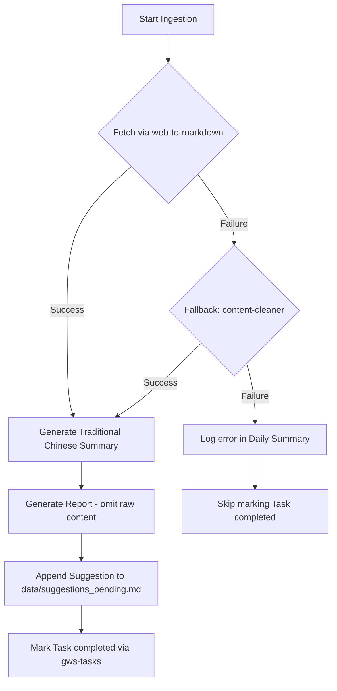

# RFC: Ingest Website Skill

## Summary

Add a new `ingest-website` agent skill that uses the `web-to-markdown` skill (powered by Jina Reader API) to ingest websites from Google Tasks in the "Delegate" list that are not Threads or YouTube URLs. This skill will summarize the content in Traditional Chinese using the 7 layers of learning, format it using the unified output report template, append a suggestion to the backlog, and mark the Google Task as completed.

## Status

**Proposed** (Approved in Design Grill) — 2026-05-25

## Motivation

The daily workflow currently processes newsletters, Threads posts, and YouTube videos. However, users frequently add other generic websites (e.g. documentation, technical blogs, news articles) to the "Delegate" task list. 

Currently, `daily-workflow` skips these tasks because it lacks a generic website ingestion routing path, logging `"Skipping '<title>': no supported URL"`. By integrating the `web-to-markdown` skill and creating a dedicated `ingest-website` skill, we can systematically ingest and analyze these documents to extract valuable insights aligned with user goals.

---

## Detailed Design

### 1. Ingestion Lifecycle (`ingest-website`)

A dedicated `ingest-website` skill will be defined at `.agents/skills/ingest-website/` with the following lifecycle:



1. **Fetch website Markdown**: The agent prepends `https://r.jina.ai/` to the target URL and fetches it using `read_url_content`.
2. **Error Fallback**: If Jina Reader fails (e.g. API error or empty content), the agent invokes `content-cleaner` (direct HTTP fetch + AI text extraction) as a fallback.
3. **Summarise**: Generate a Traditional Chinese summary following `content-summary/references/summarise.md`.
4. **Write Report**: Save to `reports/Website_YYYY_MM_DD/[domain]_[slugified_title].md`. The report conforms to `content-summary/references/output_template.md` but omits the `## 📄 原始內容` section to save tokens during daily distillation.
5. **Log Suggestion**: Extract an AI suggestion matching the user preference profile and append it to `data/suggestions_pending.md` with `{SourceType}` set to `Website`.
6. **Complete Task**: Mark the Google Task as completed using `gws tasks tasks patch`.

### 2. Integration with Daily Workflow

We will update `daily-workflow/SKILL.md` to:
- Detect any valid HTTP/HTTPS URLs that do not belong to Threads or YouTube and route them to a `website_queue`.
- Process the `website_queue` synchronously in the daily pipeline immediately after Threads tasks.
- Log successes and soft failures to the final daily workflow run summary.

```
t=0     Fire `yt2doc` for all YouTube tasks (background)
t=0     Process newsletters → ingest-newsletter (sync)
t=Ns    Process Threads tasks → ingest-threads (sync)
t=Mw    Process Website tasks → ingest-website (sync)
t=Mw+   Poll YouTube jobs → post-process (self-handled)
t=end   daily-distiller → review-suggestions
```

---

## Drawbacks

- **Token Overhead**: Ingesting websites increases the token consumption of the LLM. This is mitigated by:
  - Omitting the raw Jina Reader Markdown output from the report files (saving context in `daily-distiller`).
  - Relying on target URL references instead of storing duplicates.
- **Dependency on External APIs**: `web-to-markdown` depends on `r.jina.ai`. We mitigate this by building a automatic fallback to the local `content-cleaner` skill.

---

## Alternatives Considered

- **Asynchronous Ingestion**: Run website ingestion in the background concurrently with YouTube transcription.
  - *Rejected*: Jina Reader is extremely fast (resolving in a few seconds), so the complexity of background task management and status file tracking outweighs the tiny performance benefit.
- **Domain Blacklisting**: Prevent processing certain domains like `google.com` or login forms.
  - *Rejected*: We decided to proceed without pre-filtering. The agent will attempt all URLs. If it hits utility endpoints, the fallback handling ensures the workflow proceeds without halting.
- **Verbatim Raw Content**: Save the full web markdown.
  - *Rejected*: Website pages can be massive. Saving them verbatim inside reports bloats the daily distillation context. We decided to omit the raw text entirely and keep reports lightweight.

---

## Implementation Plan

1. **Content Summary updates**:
   - Update [filename_rules.md](.agents/skills/content-summary/references/filename_rules.md) to register `Website` source type and `[domain]_[slugified_title].md` filenames.
   - Update [output_template.md](.agents/skills/content-summary/references/output_template.md) to support the new `Website` source and omit raw content for it.
   - Update [suggestion_log.md](.agents/skills/content-summary/references/suggestion_log.md) to support `Website` type.
2. **Create New Skill**:
   - Define [SKILL.md](.agents/skills/ingest-website/SKILL.md) and [README.md](.agents/skills/ingest-website/README.md) inside `.agents/skills/ingest-website/`.
3. **Update Orchestrator**:
   - Modify [daily-workflow/SKILL.md](.agents/skills/daily-workflow/SKILL.md) routing and sequential pipeline execution.
   - Update [daily-workflow/README.md](.agents/skills/daily-workflow/README.md) documentation.
4. **Add Automated Tests**:
   - Create a website scorecard validator (`scripts/validate_website_report.py`).
   - Create a task routing test suite (`scripts/test_website_routing.py`).

---

# ADR: Ingest Website Skill Architecture

## Status

Accepted

## Context

The content intelligence pipeline successfully ingests newsletters (via Gmail), Threads posts, and YouTube videos. However, users also delegate generic articles and documentation links via Google Tasks. There is currently no routing path for these URLs, causing them to be skipped.

We need to add a generic website ingestion skill that is integrated into the daily automated routine, respects user goals and preferences, and maintains structural consistency with existing reports.

## Decision Drivers

- **Zero-Halucination Summarization**: Must enforce 7 layers of learning in Traditional Chinese.
- **Robustness**: Transient Jina Reader API errors must not crash the entire daily run.
- **Token Efficiency**: Prevent huge web bodies from bloating downstream distillation files.
- **Simplicity**: Maintain a clean synchronous orchestration model without async overhead where unnecessary.

## Decisions

1. **Skill Separation**: Create a separate `ingest-website` skill instead of merging it into daily-workflow, keeping skills focused and unit-testable.
2. **Filename Prefixing**: Use `[domain]_[slugified_title].md` to avoid date-directory file collisions for similarly titled articles.
3. **Soft-Failure with Fallback**: Attempt fallback to `content-cleaner` on fetch failure. If both fail, log the error and move to the next task without marking it completed.
4. **Omit Raw Content**: Omit raw scraped markdown from report files to conserve tokens during daily distillation.
5. **Synchronous Scheduling**: Process website queues sequentially immediately after Threads processing.

## Consequences

### Positive
- Users can ingest any generic URL directly from Google Tasks.
- Ingestion errors are captured gracefully without stopping the pipeline.
- Lightweight report format keeps token consumption low during `daily-distiller` runs.
- Standardized metadata format allows `daily-distiller` to seamlessly read website reports.

### Negative
- Omission of raw content means the user cannot review the verbatim web copy from the report itself; they must visit the source URL. (Accepted).
- Adds another directory to `reports/` (`Website_YYYY_MM_DD/`).

### Risks
- Content-heavy sites or dynamic React apps might render poorly in Jina, producing noisy summaries.
  - *Mitigation*: Fallback to `content-cleaner` enables raw HTTP fetch, and manual review of skipped items ensures robustness.
