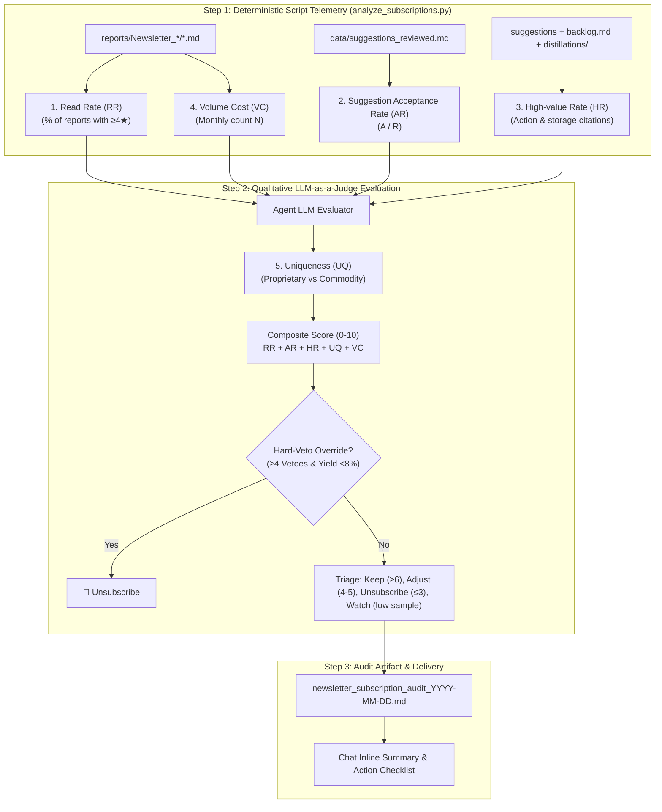

# RFC: 5-Dimension Subscription Rubric Grader for Newsletter Triage

## 1. Summary

Upgrade `.agents/skills/review-newsletter-subscriptions` with a comprehensive, 5-dimension **Subscription Rubric Grader** ($0 \sim 10$ points). The rubric quantitatively and qualitatively evaluates newsletter publications across: (1) **Read Rate** (strictly grounded in report `## ⭐ Reading Decision` star ratings), (2) **Suggestion Acceptance Rate** ($A/R$), (3) **High-value Rate** (downstream actions, backlog entries, notes, and distillation citations), (4) **Uniqueness** (semantic evaluation of irreplaceability via LLM-as-a-Judge), and (5) **Volume Cost** (attention budget fatigue penalty based on monthly volume $N$).

## 2. Status

- **Current Status**: Proposed
- **Proposal Date**: 2026-09-08
- **Last Updated**: 2026-09-08

## 3. Motivation

### Current Limitations
1. **Ad-Hoc Triage Heuristics**:
   Currently, `review-newsletter-subscriptions` uses hardcoded if-else rules in `scripts/analyze_subscriptions.py`. These rules produce a classification without a transparent, calibrated scoring rubric.
2. **Missing Dimensions of Newsletter Value**:
   - A newsletter's worth is not simply its suggestion acceptance rate.
   - It is driven by whether individual editions were actually worth reading (**Read Rate**), whether they led to retained downstream value (**High-value Rate**), whether they provided unique proprietary insights vs. commodity news (**Uniqueness**), and how much cognitive overhead they imposed on the inbox (**Volume Cost**).
3. **Telemetry Noise in Review Backlog**:
   The user does not always review suggestions immediately. Relying on "whether a suggestion was reviewed" introduces artificial unread noise. Grounding Read Rate strictly in the objective `## ⭐ Reading Decision` recommendation rating ($\ge 4★$) eliminates this dependency.
4. **Cognitive Boundary**:
   Semantic uniqueness cannot be determined deterministically by string matching alone; an LLM-as-a-Judge is uniquely suited to assess ecosystem-wide information novelty.

---

## 4. Detailed Design

### 4.1 Architecture & Workflow

The architecture follows a clean hybrid pipeline:
1. **Deterministic Telemetry (`analyze_subscriptions.py`)**: Computes $RR$, $AR$, $HR$, and $VC$ across reports and suggestion files in the workspace.
2. **LLM-as-a-Judge (Step 2)**: Evaluates $UQ$ based on article core theses and market availability.
3. **Synthesis & Triage (Step 3 & 4)**: Calculates Composite Score ($0 \sim 10$), applies Hard-Veto safety valves, and renders the audit artifact.

---

### 4.2 The 5-Dimension Rubric Specification

Each dimension is scored $0, 1, \text{ or } 2$ points, totaling $0 \sim 10$ points:

| # | Dimension | Evaluation Owner | Scoring Criteria (Anchors) | Data Grounding in Workspace |
|---|---|:---:|---|---|
| **1** | **Read Rate ($RR$)** | Deterministic Script | • **2 pts**: $\ge 50\%$ of reports rated $\ge 4★$ • **1 pt**: $25\% \sim 49\%$ of reports rated $\ge 4★$ • **0 pts**: $< 25\%$ of reports rated $\ge 4★$ | Strictly parsed from report files: `推薦指數\*{0,2}\s*[:：]\s*([★☆]+)`. Independent of user review delays. |
| **2** | **Suggestion Acceptance Rate ($AR$)** | Deterministic Script | • **2 pts**: $AR \ge 65\%$ (with $R \ge 2$) • **1 pt**: $40\% \le AR < 65\%$ (or low sample with positive signal) • **0 pts**: $AR < 40\%$ (or $R \ge 2$ and $A = 0$) | Parsed from `data/suggestions_reviewed.md`: $A / R$ ratio. |
| **3** | **High-value Rate ($HR$)** | Deterministic Script | • **2 pts**: $H \ge 2$ (or $H / \max(1, A) \ge 40\%$): multiple retained actions. • **1 pt**: $H = 1$: at least one concrete piece of stored value. • **0 pts**: $H = 0$: rejected or bare accept with no action/notes. | Multi-source trace: (1) review comments containing `backlog`, `prompt`, `知識庫`, `note`, `ADR`, `RFC`; (2) cited in `reports/distillations/`; (3) referenced in `backlog.md`. |
| **4** | **Uniqueness ($UQ$)** | LLM-as-a-Judge | • **2 pts (Proprietary / High Moat)**: Author's proprietary frameworks, exclusive benchmarks, first-hand post-mortems (e.g. Gergely Orosz, 瓦基, 朱騏). • **1 pt (Curated Synthesis)**: Good technical tutorials/digests, but underlying concepts widely available. • **0 pts (Commodity News)**: Public PR announcements, model launch tweets, generic news covered by 3+ other feeds. | Evaluated by LLM agent in Step 2 by reviewing article core theses against broader industry availability. |
| **5** | **Volume Cost ($VC$)** *(Inverted Attention Friction)* | Deterministic Script | • **2 pts (Lean / Low Overhead)**: $N < 8$ emails/month ($\le 1 \sim 2$ per week). • **1 pt (Moderate Overhead)**: $8 \le N < 18$ emails/month ($2 \sim 4$ per week). • **0 pts (High Fatigue / Daily Blast)**: $N \ge 18$ emails/month (daily deluge). | Deterministic count of reports received $N$ in `reports/Newsletter_YYYY_MM_DD/` over the window. |

---

### 4.3 Composite Score & Triage Mapping

$$\text{Subscription Score} = RR + AR + HR + UQ + VC \quad (\text{Scale: } 0 \sim 10)$$

* 🟢 **Keep ($\ge 6 / 10$)**: Consistent value, high signal-to-noise ratio, positive ROI.
* 🟡 **Adjust / Filter ($4 \sim 5 / 10$)**: Mixed signal or high volume ($N \ge 15, A \ge 2$) where separable noise (e.g., weekend specials, robotics) can be isolated via targeted Gmail rules.
* 🔴 **Unsubscribe ($\le 3 / 10$, OR Hard-Veto Safety Valve)**: Negative ROI, low read-worthiness, or severe veto violations:
  * *Hard-Veto Safety Valve*: If a publication accumulates $\ge 4$ Hard-Vetoes in `data/suggestions_filtered.md` and has an overall yield $< 8\%$, it is marked for **Unsubscribe regardless of total score**.
* ⚪ **Watch ($N < 5$ and $R < 2$)**: Low sample size without strong negative signals; monitor for another cycle.

---

### 4.4 File & Module Changes

- **[MODIFY]** `.agents/skills/review-newsletter-subscriptions/scripts/analyze_subscriptions.py`:
  - Parse `## ⭐ Reading Decision` star ratings from all report files to compute Read Rate ($RR$).
  - Multi-source trace for High-value count ($H$): check review comments, `backlog.md`, and `reports/distillations/` to compute High-value Rate ($HR$).
  - Calculate Volume Cost ($VC$) based on monthly report count $N$.
  - Output individual dimension telemetry ($RR, AR, HR, VC$) in structured JSON and markdown table.
- **[MODIFY]** `.agents/skills/review-newsletter-subscriptions/references/triage_criteria.md`:
  - Document the 5-dimension Rubric scoring definitions, point anchors, LLM-as-a-Judge Uniqueness guidelines, and triage thresholds.
- **[MODIFY]** `.agents/skills/review-newsletter-subscriptions/references/review_template.md`:
  - Update artifact template table to include the 5 rubric dimensions and composite score.
- **[MODIFY]** `.agents/skills/review-newsletter-subscriptions/SKILL.md`:
  - Update Step 1, Step 2, and Step 3 instructions to incorporate the 5-dimension rubric workflow.
- **[MODIFY]** `.agents/skills/review-newsletter-subscriptions/README.md`:
  - Add ADR-0005 documenting the 5-Dimension Subscription Rubric architecture and update Changelog.
- **[MODIFY]** `tests/test_newsletter_subscription_reviewer.py`:
  - Add tests for star rating extraction regex, high-value trace, volume cost calculation, and scoring integrity.

---

## 5. Drawbacks & Risks

1. **LLM Evaluator Token Usage**:
   - Evaluating Uniqueness requires the LLM to inspect recent report theses.
   - *Mitigation*: The LLM evaluator only inspects titles and core thesis lines in batch during Step 2 of the audit (which is run on-demand ~once per month), keeping token consumption low.
2. **Cold Start for New Subscriptions**:
   - Subscriptions with $< 5$ reports cannot be statistically evaluated.
   - *Mitigation*: Categorized cleanly as `⚪ Watch` until sufficient data accumulates.

---

## 6. Alternatives Considered

1. **Deterministic Uniqueness via Title Overlap (Rejected)**:
   - Evaluated using script-based n-gram or word overlap across reports.
   - *Reason for Rejection*: User explicitly noted that uniqueness is fundamentally non-deterministic and semantic; an LLM has broader context to judge whether an idea is commodity vs. proprietary.
2. **Read Rate via Suggestion Review History (Rejected)**:
   - Evaluated using whether the user completed review in `suggestions_reviewed.md`.
   - *Reason for Rejection*: User confirmed that review delays introduce noise. Reading Decision star ratings in the report provide an objective, noise-free quality signal.

---

# ADR-0005: 5-Dimension Subscription Rubric Grader

## Context
Evaluating newsletter subscriptions previously relied on hardcoded if-else thresholds in `analyze_subscriptions.py`. This provided insufficient granularity regarding read-worthiness, downstream knowledge retention, and attention overhead.

## Decision Drivers
- Ground Read Rate in calibrated report decisions rather than human review backlog activity.
- Balance deterministic telemetry with semantic LLM intelligence.
- Provide a clear, transparent $0 \sim 10$ score for subscription audit decisions.

## Decisions Made
1. **Hybrid Architecture**: Dedicated Python script for deterministic metrics ($RR, AR, HR, VC$); LLM-as-a-Judge in Step 2 for semantic Uniqueness ($UQ$).
2. **Reading Decision as Read Rate Source**: Consider $\ge 4★$ as read-worthy full-text threshold.
3. **Safety Valve Preservation**: Retain Hard-Veto overrides so that publications violating hard constraints cannot game the numerical score.

## Consequences
- **Positive**: Transparent, explainable 0–10 score; accurately reflects inbox fatigue and downstream value; zero review backlog noise.
- **Negative**: Step 2 requires an LLM call to evaluate Uniqueness during monthly audits.
