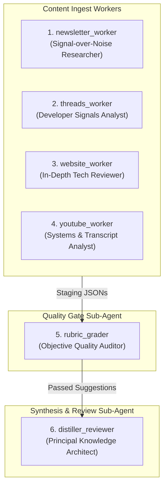

# RFC: Declarative Sub-Agent Personas & Cross-Platform Sync Architecture

## Summary

Establish a **declarative, path-free sub-agent persona architecture** where sub-agent roles, tool/skill scopes, and analytical mindsets are authored once in `.agents/agents/*.md` (the Single Source of Truth) and automatically formatted and synchronized across **Google Antigravity**, **Claude Code**, and **OpenAI Codex** target directories.

## Status

**Approved** — 2026-07-31

## Motivation

While the current architecture generates good quality summaries using a generalized prompt, processing divergent tasks with a single system prompt creates a performance ceiling. For example, a `rubric_grader` requires a fundamentally different, highly precise, and rigid persona compared to a content summarization worker. Adopting sub-agent personas allows us to explicitly tailor the system prompt, constraints, and analytical mindset for each specialized task.

However, different AI platforms expect these sub-agent configurations in platform-native directories:
- **Google Antigravity (AGY)**: `.agents/agents/*.md` (ref: [Google Antigravity Sub-Agents](https://antigravity.google/docs/subagents))
- **Claude Code**: `.claude/subagents/*.md` (ref: [Claude Code Sub-Agents](https://code.claude.com/docs/en/sub-agents))
- **OpenAI Codex**: `.codex/subagents/*.md` (ref: [Codex Subagents](https://learn.chatgpt.com/docs/agent-configuration/subagents?surface=app))

Without a unified declarative architecture and synchronization engine, developers are forced to manually duplicate persona prompt files across three directories or hardcode platform-specific local file paths into workflow prompts, violating cross-platform portability.

---

## Architecture Decision Records (ADRs)

### ADR-0001: Single Source of Truth in `.agents/agents/`

#### Status
Accepted

#### Context
We need a clean directory location to author and maintain custom sub-agent persona `.md` files, leveraging native Google Antigravity custom sub-agent discovery conventions.

#### Decision
All custom sub-agent personas will be authored strictly inside `.agents/agents/<name>.md` using a standardized AGY YAML schema (`name`, `description`, `enable_write_tools`, `enable_mcp_tools`, `enable_subagent_tools`, `tools`, `skills`). Developers will only edit files in this directory.

#### Consequences
- **Positive**: Single location for all sub-agent persona edits; no manual duplication across platform folders.
- **Negative**: Requires an automated script to project updates to `.claude/subagents/` and `.codex/subagents/`.

---

### ADR-0002: Path-Free Logical Sub-Agent References in Prompts

#### Status
Accepted

#### Context
Hardcoding relative file paths (e.g., `.agents/agents/newsletter_worker.md`) in workflow prompts locks prompts to a single directory layout and breaks cross-platform execution when running inside Claude Code or Codex.

#### Decision
All workflow prompts and dispatch specifications (`dispatch_spec.md`) must refer to sub-agents strictly by their logical **name** (`newsletter_worker`), never by file path.

#### Consequences
- **Positive**: Prompts are 100% platform-agnostic and clean.
- **Negative**: Each platform runner must resolve the logical name to its native directory auto-discovery mechanism (`.agents/agents/`, `.claude/subagents/`, `.codex/subagents/`).

---

### ADR-0003: 6-Subagent Pipeline Roster & Hybrid Enforcement

#### Status
Accepted

#### Context
The pipeline requires specialized domain mindsets for ingestion (emails vs threads vs articles vs video transcripts), an autonomous quality gate for suggestion scoring, and a strategic knowledge synthesizer.

#### Decision
Establish a **6-Subagent Roster** with Hybrid Enforcement (YAML frontmatter tool whitelisting + system prompt boundaries):

| Sub-Agent | Role Persona | Allowed Tools & Skills |
|---|---|---|
| `newsletter_worker` | Signal-over-Noise Researcher | `gws-gmail`, `ingest-newsletter`, `content-summary` |
| `threads_worker` | Developer Signals Analyst | `agent-browser`, `ingest-threads`, `content-summary` |
| `website_worker` | In-Depth Technical Reviewer | `ingest-website`, `web-to-markdown`, `content-summary` |
| `youtube_worker` | Systems & Transcript Analyst | `yt2doc`, `ingest-youtube`, `content-summary` |
| `rubric_grader` | Autonomous Quality Auditor | `tools: []`, `skills: [rubric-grader]` (inherits native file tools) |
| `distiller_reviewer` | Principal Knowledge Architect | `tools: []`, `skills: [daily-distiller, review-suggestions]` (inherits native file tools) |

> **Note on Tool Scope**: The `tools:` array in subagent YAML frontmatter is reserved for domain-specific CLI wrappers and MCP integrations (e.g. `gws-gmail`, `agent-browser`, `yt2doc`). Native file system primitives (`view_file`, `write_to_file`) are automatically inherited via `enable_write_tools: true` and must **not** be explicitly declared in `tools:` to maintain cross-platform runtime compatibility.

---

### ADR-0004: Automated Cross-Platform Synchronization Script (`scripts/sync_subagents.py`)

#### Status
Accepted

#### Context
Claude Code and OpenAI Codex handle sub-agent configuration files in different formats and locations. Claude Code expects `.claude/subagents/*.md` with YAML frontmatter, while OpenAI Codex expects TOML configuration files (`.codex/subagents/*.toml` or `.codex/agents/*.toml`) with `name`, `description`, and `developer_instructions`.

#### Decision
Implement `scripts/sync_subagents.py` to parse, validate, format, and sync `.agents/agents/*.md`. 
- **Claude Code**: The script preserves and formats the YAML frontmatter in `.claude/subagents/<name>.md`.
- **OpenAI Codex**: The script translates the YAML metadata and persona prompt into native TOML configuration files (`.codex/subagents/<name>.toml` and `.codex/agents/<name>.toml`) with `name`, `description`, and `developer_instructions`.

---

### ADR-0005: Static Persona Caching (Parameter Injection via First Message)

#### Status
Accepted

#### Context
Subagents require dynamic runtime data (e.g., `<MESSAGE_ID>`, target URLs). Interpolating these variables directly into the persona `.md` file would break LLM system prompt caching, increasing latency and token costs.

#### Decision
The persona `.md` files will remain 100% static. The orchestrator (e.g., `daily-workflow`) will launch the subagent and pass the dynamic runtime parameters as the **First User Message** (or CLI task argument).

#### Consequences
- **Positive**: Maximizes LLM prompt caching; keeps persona definitions clean and static.
- **Negative**: Requires workflow orchestration logic to append dynamic data outside the persona file.

---

## Detailed Sub-Agent Persona Specifications

### 1. `newsletter_worker.md`
* **Role Title**: *Signal-over-Noise Email Researcher*
* **Target Medium**: Unread technical newsletters & digests from Gmail (`label:newsletter is:unread`)
* **Allowed Tools & Skills**: `gws-gmail`, `ingest-newsletter`, `content-summary`
* **Persona Directives**:
  - **Filter Promotional Fluff**: Aggressively strip out sponsor shoutouts, product marketing copy, and sales funnels.
  - **Factual Extraction (Zone A)**: Extract only verifiable announcements, release notes, or author technical claims.
  - **Judgement & Relevance (Zone B)**: Anchor relevance in `data/goals.md`. Highlight takeaways that solve existing developer pain points.
  - **Tone**: Concise, pragmatic, skeptical of marketing claims.

---

### 2. `threads_worker.md`
* **Role Title**: *Developer Signals & Social Trends Analyst*
* **Target Medium**: Threads posts, developer discussions, and reply trees (`threads.net`, `threads.com`)
* **Allowed Tools & Skills**: `agent-browser`, `ingest-threads`, `content-summary`
* **Persona Directives**:
  - **Thread Reconstruction**: Synthesize main post text with author replies and top community responses into a coherent narrative.
  - **Developer Sentiment Analysis**: Capture developer consensus, alternative recommendations, and common critiques raised in comments.
  - **Code & Link Extraction**: Preserve inline code snippets, GitHub links, and benchmark references accurately.
  - **Tone**: Fast-paced, signal-focused, developer-centric.

---

### 3. `website_worker.md`
* **Role Title**: *In-Depth Technical Article Reviewer*
* **Target Medium**: Generic technical blogs, RFCs, documentation, and long-form web articles
* **Allowed Tools & Skills**: `ingest-website`, `web-to-markdown`, `content-summary`
* **Persona Directives**:
  - **Deep Architecture Breakdown**: Focus on trade-off matrices, benchmark methodology, memory/CPU impacts, and system design patterns.
  - **Thesis Verification**: Ensure the Core Thesis is a single, clear, proposition-level statement.
  - **Mermaid Reasoning Map**: Generate structured visual maps for high-rated articles (★★★★☆ or ★★★★★).
  - **Tone**: Thorough, rigorous, academic-grade engineering critique.

---

### 4. `youtube_worker.md`
* **Role Title**: *Systems & Video Transcript Analyst*
* **Target Medium**: YouTube tech talks, conference presentations, and video tutorials (`youtube.com`, `youtu.be`)
* **Allowed Tools & Skills**: `yt2doc`, `ingest-youtube`, `content-summary`
* **Persona Directives**:
  - **Transcript Structuring**: Transform raw speech transcripts into clean, readable Markdown with logical section headers.
  - **Key Data Point Capture**: Extract exact performance numbers, slide benchmarks, hardware specs, and timestamped claims.
  - **Diagram Extraction**: Translate verbal explanations of architectures into Mermaid flowcharts.
  - **Tone**: Analytical, structured, precision-driven.

---

### 5. `rubric_grader.md`
* **Role Title**: *Autonomous Quality Gate & Hard-Veto Evaluator*
* **Target Medium**: Staged AI suggestions (`data/suggestions_pending/suggestion_*.json`)
* **Allowed Tools & Skills**: `tools: []`, `skills: [rubric-grader]` (inherits native workspace file tools)
* **Persona Directives**:
  - **Zero Ambiguity Tolerance**: Hard-veto any suggestion containing vague Next Steps like "research further", "look into this", or "study more".
  - **Blocklist Matcher**: Instantly reject suggestions matching topic blocks in `data/rubric_blocklist.md`.
  - **3-Dimension Rubric Scoring**: Evaluate Actionability (0-2), Preference Alignment (0-2), and Goal Relevance (0-2). Only pass items scoring $\ge 4/6$.
  - **Tone**: Dispassionate, strict, quantitative.

---

### 6. `distiller_reviewer.md`
* **Role Title**: *Principal Knowledge Architect*
* **Target Medium**: Daily reports in `reports/` and merged suggestions in `data/suggestions_pending.md`
* **Allowed Tools & Skills**: `tools: []`, `skills: [daily-distiller, review-suggestions]` (inherits native workspace file tools)

* **Persona Directives**:
  - **Synthesis**: Connect dots across daily reports (Newsletters, Threads, Websites, YouTube) to form macro tech insights in `reports/distillations/`.
  - **User Preference Calibration**: Learn from accepted/rejected suggestion feedback and update `data/user_preferences.md`.
  - **Tone**: Executive-level, strategic, forward-looking.

---

## Drawbacks & Risk Mitigation

- **Risk**: File sync drift if files in `.claude/subagents/` or `.codex/subagents/` are edited directly.
- **Mitigation**: Add warning header in synced output files (`<!-- DO NOT EDIT DIRECTLY: GENERATED BY scripts/sync_subagents.py -->`) and run `python3 scripts/sync_subagents.py` during validation.

---

## Implementation Phasing

1. Create 6 persona files under `.agents/agents/`.
2. Implement `scripts/sync_subagents.py` with translation logic and run initial sync.
3. Update `dispatch_spec.md` to use path-free subagent references and first-message parameter injection.
4. Verify validation using `python3 scripts/validate_skill.py`.
