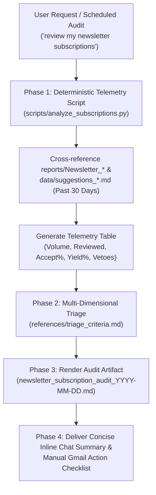

# RFC: Newsletter Subscription Reviewer Skill (`review-newsletter-subscriptions`)

## 1. Summary

Introduce a dedicated agent skill `review-newsletter-subscriptions` under `.agents/skills/review-newsletter-subscriptions/` that automates health audits and ROI evaluations of technical newsletter subscriptions. The skill aggregates 30-day ingestion reports (`reports/Newsletter_*`), suggestion review histories (`data/suggestions_reviewed.md`), filter logs (`data/suggestions_filtered.md`), and pending backlogs (`data/suggestions_pending.md`). It computes exact conversion telemetry (Acceptance Rate, Yield Rate, Hard-Veto frequency) using a deterministic Python script, and delivers evidence-backed triage recommendations (Keep, Unsubscribe, Adjust/Filter) through a structured review artifact.

---

## 2. Status

- **Current Status**: Approved & Implemented
- **Proposal Date**: 2026-09-08
- **Last Updated**: 2026-09-08
- **Implementation PR/Branch**: `main`

---

## 3. Motivation

As part of the daily automated workflow, the ingestion pipeline continuously reads unread emails tagged `label:newsletter is:unread` via `ingest-newsletter` and produces Markdown summaries in `reports/Newsletter_YYYY_MM_DD/`. Over a 30-day window, this system processed **205 newsletter reports** across 20 distinct publishers.

However, an empirical audit of suggestion acceptance histories reveals severe disparities in signal-to-noise ratio:

1. **High-Signal Core Sources**:
   - Publishers like **朱騏 (Henry Chu)** (100% acceptance, 75% yield), **The Code** (75% acceptance), **The Pragmatic Engineer** (66.7% acceptance), and **Ally Hsieh** (66.7% acceptance) consistently generate high-leverage outcomes—including core agent skills (e.g. `agent-rules-reviewer`, `decision-sparring`), critical prompt templates, and actionable career decisions.
2. **Systemic Hard-Veto Mismatches**:
   - **Hugging Face Daily Papers** generated 22 reports in 30 days, but 80% were automatically blocked by the user's hard-veto against academic paper reading (`Paper reading tasks / 論文研讀`), yielding only 1 accepted action (4.5% yield).
   - **Gary Chen (創作者的秘密)** generated 14 reports, with 43% blocked by the hard-veto against Claude Code/Cursor tools, while remaining issues were paywalled teasers.
3. **High-Volume Interview Trivia & Sales Fatigue**:
   - **ByteByteGo (Alex Xu)** (20 reports) and **System Design One (Neo Kim)** (11 reports) suffered from high rejection rates (>71% and 75% respectively). Most suggestions involved abstract system design diagrams, repetitive interview quizzes, or course promotions that do not translate to hands-on workflow execution.
4. **Viral Noise Dilution**:
   - **Superhuman** generated 31 reports (highest volume), but frequently included viral consumer tech, robotics, and rocket launches that required manual filtering.

Without an automated, data-backed audit skill, users suffer from decision paralysis and FOMO, tolerating inbox clutter and wasting automated ingestion compute on low-yield subscriptions.

---

## 4. Detailed Design

### 4.1 Architecture & Workflow

The skill adopts a **Hybrid Architecture** that couples deterministic Python telemetry calculation with LLM qualitative reasoning:

### 4.2 Telemetry & Triage Heuristics

The evaluation relies on 4 core quantitative metrics and qualitative indicators documented in [references/triage_criteria.md](../../.agents/skills/review-newsletter-subscriptions/references/triage_criteria.md):

| Metric | Formula | Target Benchmark | Low-Quality Indicator |
|---|---|:---:|:---:|
| **Acceptance Rate** | $A / R$ (Accepted / Reviewed) | $\ge 60\%$ | $< 40\%$ (with $R \ge 3$) |
| **Overall Yield Rate** | $A / N$ (Accepted / Reports) | $\ge 20\%$ | $< 8\%$ (with $N \ge 10$) |
| **Hard-Veto Rate** | $F / (R + F)$ | $0\%$ | $\ge 50\%$ (with $F \ge 3$) |
| **Paywall/Ad Ratio** | Teasers / Total Reports | $0\%$ | $\ge 50\%$ |

#### Triage Action Buckets:
- 🟢 **Keep (繼續訂閱)**: Acceptance rate $\ge 60\%$ or Yield $\ge 20\%$; delivered transformative skills or prompts.
- 🔴 **Unsubscribe (建議取消訂閱)**: Acceptance rate $< 40\%$ ($R \ge 3$), zero acceptances ($R \ge 2$), high veto ratio ($F \ge 4$), or volume fatigue with negligible yield ($N \ge 10$, Yield $< 8\%$).
- 🟡 **Adjust / Filter (設定 Gmail 篩選器)**: High volume ($N \ge 15$), solid core value ($A \ge 2$), but mixed with separable noise sub-topics ($F \ge 3$).
- ⚪ **Watch (持續觀察)**: Low volume ($N < 5$, $R < 2$) without strong negative signals, or pending items.

### 4.3 Operational Boundaries & Safety Gates

1. **Deterministic Accuracy**: All counts, percentages, and veto classifications are calculated in Python (`scripts/analyze_subscriptions.py`) rather than estimated via in-context LLM arithmetic.
2. **Human-in-the-Loop Execution**: The agent never performs destructive unsubscriptions or modifies Gmail settings autonomously. It generates exact search queries (`from:bytebytego.com`), and the user performs manual unsubscriptions in the inbox.
3. **Decoupled Scheduling**: The skill remains pure On-Demand. Periodic monthly auditing is orchestrated via the runtime environment (`/schedule`) rather than hardcoding cron logic inside pipeline code.

### 4.4 File & Module Changes

- **[NEW]** [`.agents/skills/review-newsletter-subscriptions/SKILL.md`](../../.agents/skills/review-newsletter-subscriptions/SKILL.md) — Lean Spine instruction file (<100 lines) with frontmatter, workflow steps, and progressive disclosure links.
- **[NEW]** [`.agents/skills/review-newsletter-subscriptions/scripts/analyze_subscriptions.py`](../../.agents/skills/review-newsletter-subscriptions/scripts/analyze_subscriptions.py) — CLI analyzer script supporting `--days`, `--start-date`, `--end-date`, and `--json`.
- **[NEW]** [`.agents/skills/review-newsletter-subscriptions/references/triage_criteria.md`](../../.agents/skills/review-newsletter-subscriptions/references/triage_criteria.md) — Decision heuristics and quantitative threshold definitions.
- **[NEW]** [`.agents/skills/review-newsletter-subscriptions/references/review_template.md`](../../.agents/skills/review-newsletter-subscriptions/references/review_template.md) — Standardized Markdown audit artifact template.
- **[NEW]** [`.agents/skills/review-newsletter-subscriptions/evals/evals.json`](../../.agents/skills/review-newsletter-subscriptions/evals/evals.json) — 3 evaluation test cases.
- **[NEW]** [`.agents/skills/review-newsletter-subscriptions/README.md`](../../.agents/skills/review-newsletter-subscriptions/README.md) — Architecture documentation, ADRs 0001–0004, and changelog.
- **[NEW]** [`tests/test_newsletter_subscription_reviewer.py`](../../tests/test_newsletter_subscription_reviewer.py) — Automated test suite covering YAML validation, line count budgets, schema verification, and script execution.

---

## 5. Drawbacks & Risks

- **Script Maintenance Overhead**: Introducing a Python script requires automated test coverage and ongoing maintenance if report directory naming conventions evolve.
  - *Mitigation*: The analyzer script uses regex-based directory matching (`Newsletter_\d{4}_\d{2}_\d{2}`) and is thoroughly covered by 9 unit tests in `tests/test_newsletter_subscription_reviewer.py`.
- **Sender Name Normalization Drift**: New newsletters with unexpected filenames might fall into the fallback category.
  - *Mitigation*: The normalizer function handles prefixes and title keywords, defaulting to the first two filename segments if an unknown sender appears.

---

## 6. Alternatives Considered

- **Alternative A: Pure Markdown Prompt (Zero-Script)**
  - *Description*: Have the LLM read raw directory listings and markdown files directly to estimate counts and percentages.
  - *Rationale for Rejection*: Scanning 200+ reports and 650+ suggestions exceeds context limits and causes mental arithmetic hallucinations in conversion rate calculations. The user explicitly approved an exception to Zero-Script for large-scale data precision.
- **Alternative B: Hardcoded Monthly Cron in `daily-workflow`**
  - *Description*: Embed monthly trigger logic directly in `daily-workflow.py` to automatically run subscription audits on the 1st of every month.
  - *Rationale for Rejection*: Violates minimal code scope and tight-couples an occasional audit task to the daily operational pipeline. Decoupled scheduling via Antigravity's `/schedule` keeps the skill clean and modular.
- **Alternative C: Automated Gmail API Unsubscribe**
  - *Description*: Use browser automation or Gmail API to automatically find and click "Unsubscribe" headers/links.
  - *Rationale for Rejection*: Unsubscribing is an external, irreversible account action that often requires web logins or human verification. The user explicitly chose to keep unsubscription manual.

---

# ADR: Architecture Decision Records

## ADR-0001: Hybrid Architecture (Deterministic Python Script + LLM Synthesis)
- **Status**: Accepted (2026-09-08)
- **Deciders**: User & Antigravity Agent
- **Decision**: Bundle a lightweight, deterministic Python script (`scripts/analyze_subscriptions.py`) for file aggregation and mathematical calculations; use the LLM strictly for qualitative reasoning, context interpretation, and narrative generation.
- **Consequences**: 100% calculation accuracy (<0.05s execution); zero token waste on counting; verifiable via unit tests.

## ADR-0002: Multi-Dimensional Triage Criteria
- **Status**: Accepted (2026-09-08)
- **Deciders**: User & Antigravity Agent
- **Decision**: Evaluate newsletters across 4 dimensions (Acceptance Rate, Yield Rate, Hard-Veto Rate, Paywall/Ad Ratio) rather than relying on a single simplistic percentage cutoff.
- **Consequences**: Prevents false negatives for high-value low-volume publishers and accurately captures different failure modes (paywall, paper reading, interview trivia).

## ADR-0003: Human-in-the-Loop for Irreversible Subscription Actions
- **Status**: Accepted (2026-09-08)
- **Deciders**: User & Antigravity Agent
- **Decision**: Enforce a strict boundary where the agent delivers high-signal decision intelligence and copyable Gmail search queries, while the user manually clicks unsubscribe links.
- **Consequences**: Zero risk of accidental unsubscriptions or unwanted Gmail filter changes.

## ADR-0004: Decoupled Scheduling via Runtime Environment
- **Status**: Accepted (2026-09-08)
- **Deciders**: User & Antigravity Agent
- **Decision**: Keep the skill purely On-Demand without embedded scheduling logic; schedule recurring runs externally via Antigravity `/schedule`.
- **Consequences**: Eliminates code-level coupling to daily pipelines while satisfying monthly recurring requirements.
