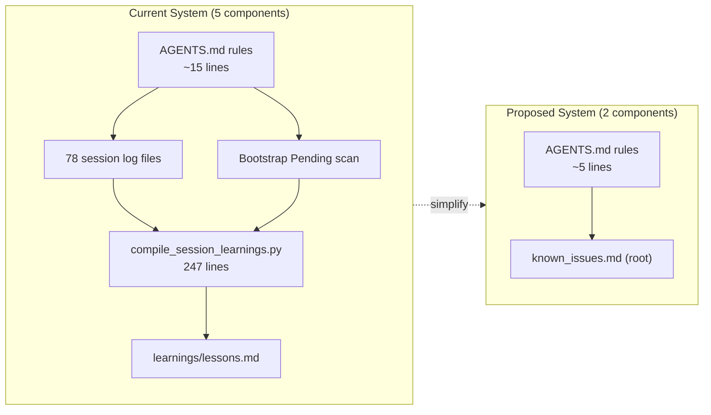

# RFC: Simplify Session Decision Logging to Known Issues Registry

## Summary

Replace the current Session Decision Logging & Closed-Loop Learning system (78 session log files, a 247-line compiler script, and ~15 lines of AGENTS.md rules) with a lightweight **Known Issues Registry** — a single curated file read at session start, with direct-append on failure. No compiler. No per-session log files. No bootstrap scan.

## Status

**Proposed** — 2026-07-29

Supersedes: [closed-loop-session-logging.md](closed-loop-session-logging.md) (2026-06-17)

## Motivation

The closed-loop session logging system ([RFC](closed-loop-session-logging.md)) was designed around the assumption that AI agents learn incrementally over time. After 78 sessions of real-world usage, the evidence shows a mismatch between that assumption and how LLM-based agents actually operate.

### Quantitative Assessment

| Component | Volume | Reuse Rate |
|---|---|---|
| Session decision log files | 78 files, ~90KB total | **Never re-read** (transcripts serve the same audit purpose) |
| `lessons.md` entries | ~15 actionable gotchas | **Read every session** — this is the useful part |
| Compiler script executions | Runs at every session wrap-up | Extracts 0 lessons from ~70% of sessions (all-Success logs) |
| Bootstrap Pending scan | Scans 78 files at every startup | Finds Pending entries in <5% of cases |

### Root Cause Analysis

Each conversation is **stateless**. The agent doesn't accumulate understanding — it reads files. Given that reality:

1. **Duplicate audit trail**: The 5-column decision table is a less-detailed duplicate of the conversation transcript (`transcript.jsonl`) that already exists in `~/.gemini/antigravity/brain/<conversation-id>/`.
2. **Over-engineered pipeline**: The compiler script is 247 lines of Python whose net output is ~15 bullets that could be appended directly by the agent.
3. **Unnecessary directory**: The `learnings/` directory contains only `lessons.md` and one unrelated assessment file — it doesn't justify its own directory.
3. **Phantom maintenance**: The bootstrap Pending scan is overhead for a problem that shouldn't exist — outcomes should be recorded immediately, not deferred.
4. **Misleading framing**: "Closed-loop learning" implies accumulated intelligence, but the actual mechanism is a static lookup table.

### What Genuinely Works

`lessons.md` prevents repeated failures. Without it, every new session would naively try `agent-browser` on macOS, forget to wrap `gws` in `bash -c`, etc. This short-circuits 2-3 minute failure loops per session. This value must be preserved.

## Detailed Design

### Architecture: Before and After



### New AGENTS.md Rule

Replace the entire "Session Decision Logging & Closed-Loop Learning" section (lines 52-66) with:

```markdown
- Known Issues Registry: A curated `known_issues.md` file at the project root tracks environment-specific failures and workarounds.
    - Read it at session start.
    - When you encounter a failure or needed workaround, scan existing entries for duplicates, then append using the format: `- **[Context]**: [What failed] — [Why] → [Workaround]`.
    - Do not log successes. Only record failures and fallbacks.
    - Periodically prune stale entries when the underlying issue is fixed. If an issue is verified permanent, suggest promoting it to the relevant SKILL.md.
```

Additionally, remove the GWS sandbox rule from the Permissions & Authorization section (line 73) — this is operational learning, not a project guideline, and belongs in `known_issues.md`.

### Entry Format

Three-part format with semantic separators:

```
- **[Context]**: [What failed] — [Why it failed] → [Workaround]
```

- `—` separates failure from causal explanation (enables generalization)
- `→` separates cause from actionable workaround (enables quick scanning)

### Deduplication

Before appending a new entry, the agent must scan existing entries to check for semantic duplicates. LLM-based semantic comparison is superior to the current script's string normalization (which already failed — 4 near-duplicate entries exist in current `lessons.md`).

### Promotion Path

When a known issue is verified to be permanent and affects core workflow behavior, the agent should suggest promoting it to the relevant `SKILL.md`. AGENTS.md is reserved for project rules and guidelines only, not operational learnings.

### Migration

During implementation, existing `lessons.md` entries will be curated:
- **Carried over**: Generalizable gotchas (e.g., "agent-browser fails on macOS sandbox")
- **Dropped**: Instance-specific incidents (e.g., one-time 404s for specific URLs, unavailable YouTube videos)
- **Deduplicated**: 4 near-identical agent-browser entries collapsed into 1

## Alternatives Considered

### Alternative 1: Keep Current System As-Is

- **Rejected**: 78 session logs are never re-read, compiler runs mostly no-op, bootstrap scan rarely finds Pending entries. The ceremony doesn't justify the value.

### Alternative 2: Remove Entirely

- **Rejected**: `lessons.md` genuinely prevents repeated failures. Removing the entire system would regress session efficiency.

### Alternative 3: Add Expiry/Staleness Mechanism

Options considered: date stamps on entries, two-section split (Persistent/Transient), or TTL-based pruning.

- **Rejected**: At ~15 entries, the file is too small for expiry to pay for itself. Manual pruning on demand is sufficient.

## Consequences

### Positive

- **Reduced overhead**: Eliminates ~5-10% token budget spent on meta-bookkeeping per session
- **Simpler mental model**: 2 components instead of 5
- **Better dedup**: Semantic comparison by LLM > string normalization by script
- **Honest framing**: "Known issues" accurately describes the mechanism
- **Clean separation**: AGENTS.md = project rules, SKILL.md = permanent operations, known_issues.md = transient gotchas

### Negative

- **No portable audit trail**: Session decision logs were version-controlled; conversation transcripts are in app data directory. Git history preserves deleted logs.
- **LLM append discipline**: Relies on the agent to scan for duplicates before appending — no script-based guarantee.

---

# ADR 1: Delete Session Decision Logs and Rely on Conversation Transcripts

## Status

Accepted — 2026-07-29

## Context

The system maintains per-session decision log files (`docs/decision_logs/session_<id>.md`) as audit trails. After 78 sessions, these files have never been re-read by any agent or human. Meanwhile, conversation transcripts (`transcript.jsonl`) in `~/.gemini/antigravity/brain/` provide a more complete, unedited record of every action taken.

The session logs are a lossy summary of the transcript — they capture fewer details in a structured 5-column table format.

## Decision Drivers

- Session logs are never re-read after creation
- Conversation transcripts are more complete and already exist
- 78 files consume disk space and clutter the repository
- The bootstrap Pending scan adds startup overhead

## Considered Options

### Option 1: Delete all session logs

- **Pros**: Clean repo, no maintenance overhead, git history preserves them
- **Cons**: Lose version-controlled audit trail (transcripts are in app data, not git)

### Option 2: Keep last N session logs as archived examples

- **Pros**: Some historical reference preserved in-repo
- **Cons**: Arbitrary cutoff, still clutters directory

### Option 3: Keep all session logs

- **Pros**: No data loss risk
- **Cons**: 78 files that serve no purpose, continued maintenance overhead

## Decision

**Delete all 78 session log files and the `docs/decision_logs/` directory.** Git history serves as the preservation mechanism.

## Rationale

The session logs are a less-detailed duplicate of conversation transcripts. The truly valuable information (the ~15 gotchas) is preserved in `known_issues.md`. The files remain in git history for any future forensic needs.

## Consequences

### Positive
- Repository is cleaner (~90KB of dead files removed)
- No bootstrap Pending scan overhead
- Single source of truth for audit (conversation transcripts)

### Negative
- Audit trail moves from version-controlled to app data directory
- If Antigravity is reinstalled, transcripts may be lost (but gotchas survive in `known_issues.md`)

---

# ADR 2: Direct-Append by LLM Instead of Compiler Script

## Status

Accepted — 2026-07-29

## Context

The current system uses a [247-line Python script](../scripts/compile_session_learnings.py) (`compile_session_learnings.py`) that:
1. Parses markdown tables from session log files
2. Filters for rows with `Failed` / `Fallback` outcomes
3. Classifies entries by tool context
4. Deduplicates against existing `lessons.md` entries using string normalization
5. Appends new lessons under categorized headers

Despite this pipeline, 4 near-duplicate entries exist in `lessons.md` (all describing "agent-browser fails on macOS → use Jina Reader"), because the string normalization missed semantic duplicates with different wording.

## Decision Drivers

- Script deduplication already fails on semantic duplicates
- LLMs can perform semantic comparison natively
- Script adds 247 lines of maintenance surface
- Pipeline requires session logs to exist (circular dependency with ADR 1)

## Considered Options

### Option 1: Direct-append by LLM with semantic dedup

- **Pros**: No script to maintain, better dedup quality, immediate recording
- **Cons**: Relies on LLM discipline; no hard guarantee

### Option 2: Simplified script (direct-append with script-based dedup)

- **Pros**: Deterministic dedup
- **Cons**: Still can't catch semantic duplicates, still requires maintenance

### Option 3: Keep current compiler script

- **Pros**: Proven to work (mostly)
- **Cons**: 247 lines for 15 bullets, requires session logs, dedup already fails

## Decision

**Direct-append by LLM with semantic dedup scan.** Delete `compile_session_learnings.py`.

## Rationale

The LLM reads `known_issues.md` at startup anyway. When encountering a failure, it can semantically compare the new issue against existing entries — a capability the string-normalization script lacks. The AGENTS.md rule explicitly instructs "scan existing entries for duplicates" before appending.

## Consequences

### Positive
- No script to maintain
- Better deduplication (semantic > string normalization)
- Entries recorded immediately on failure (no deferred Pending state)

### Negative
- Dedup quality depends on LLM compliance with the instruction
- Periodic manual pruning may be needed as a safety net

---

# ADR 3: Three-Part Entry Format with Causal Explanation

## Status

Accepted — 2026-07-29

## Context

The current `lessons.md` entries use an unstructured format inherited from the compiler script output:
```
- **[Decision text]**: [Outcome text]
```

This tells the agent *what* failed and *what to do*, but not *why* it failed. Without causal understanding, the agent cannot generalize to similar-but-different situations.

## Decision Drivers

- Causal explanations enable generalization to analogous situations
- Entries must remain scannable for quick action lookup
- Risk of incorrect causal explanations (agent may hypothesize incorrectly)
- File is small (~15 entries), so verbosity cost is low

## Considered Options

### Option 1: Concise two-part format (`What → Workaround`)

- **Pros**: Minimal, fast to scan
- **Cons**: No generalization potential

### Option 2: Three-part format (`What — Why → Workaround`)

- **Pros**: Enables generalization, structured separators maintain scannability
- **Cons**: ~30% longer entries, risk of incorrect "why"

### Option 3: Verbose paragraph format

- **Pros**: Maximum context
- **Cons**: Hard to scan, excessive for a lookup table

## Decision

**Three-part format**: `- **[Context]**: [What failed] — [Why] → [Workaround]`

## Rationale

The `—` and `→` separators keep entries scannable while enabling causal understanding. At ~15 entries, the 30% verbosity increase is negligible (~200 extra tokens). The risk of incorrect causal explanations is mitigated by the existing AGENTS.md rule requiring unverified claims to be labeled as hypotheses.

## Consequences

### Positive
- Agents can generalize from known issues to novel but related situations
- Structured format is machine-parseable if needed in the future
- `→` enables quick scanning for just the workaround

### Negative
- Slightly longer entries
- Causal explanations may occasionally be inaccurate

---

# ADR 4: Separate AGENTS.md (Project Rules) from Operational Learnings

## Status

Accepted — 2026-07-29

## Context

AGENTS.md currently contains both project-level guidelines and operational learnings. For example, line 73 contains the GWS sandbox rule — an environment-specific operational workaround that sits alongside project conventions like "make every change as simple as possible."

This mixing conflates two different types of knowledge:
- **Project rules**: Stable, intentional design choices (e.g., "no over-engineering")
- **Operational learnings**: Environment-specific gotchas that may change (e.g., "use `/opt/homebrew/bin/gws`")

## Decision Drivers

- AGENTS.md is the project constitution — it should contain stable rules
- Operational learnings are transient and environment-specific
- Mixing the two creates confusion about what's permanent vs. what's a workaround
- Need a clear promotion path for learnings that prove permanent

## Considered Options

### Option 1: Keep everything in AGENTS.md

- **Pros**: Single file to read
- **Cons**: Mixes stable rules with transient workarounds

### Option 2: Two-tier separation (AGENTS.md + known_issues.md)

- **Pros**: Clean separation of concerns
- **Cons**: Two files to maintain

### Option 3: Three-tier separation (AGENTS.md + SKILL.md + known_issues.md)

- **Pros**: Clear hierarchy with promotion path
- **Cons**: More complex, but each tier has a distinct purpose

## Decision

**Three-tier hierarchy** with a clear promotion path:

| Tier | File | Purpose | Stability |
|---|---|---|---|
| 1 | `AGENTS.md` | Project rules & guidelines | Permanent |
| 2 | `<skill>/SKILL.md` | Permanent operational knowledge for specific skills | Long-lived |
| 3 | `known_issues.md` (root) | Transient environment-specific gotchas | May change |

Promotion is **user-triggered only**: the agent may suggest promotion to SKILL.md, but does not autonomously edit AGENTS.md or SKILL.md for operational learnings.

## Rationale

This creates a natural lifecycle for operational knowledge: discovered as a gotcha in `known_issues.md`, verified over multiple sessions, then promoted to the relevant SKILL.md when confirmed permanent. AGENTS.md stays clean as the project constitution.

## Consequences

### Positive
- AGENTS.md remains a concise, stable project constitution
- Known issues file stays focused on active, transient gotchas
- Clear promotion path prevents knowledge from being stuck in the wrong tier

### Negative
- The GWS sandbox rule must be removed from AGENTS.md (one-time migration)
- Promotion from known_issues.md to SKILL.md requires user judgment

---

## Implementation Plan

### Files to Create

| File | Description |
|---|---|
| `known_issues.md` (root) | Curated known issues registry with ~12 deduplicated, three-part entries |

### Files to Modify

| File | Change |
|---|---|
| `AGENTS.md` | Replace session logging section (lines 52-66) with Known Issues Registry rule (~5 lines); remove GWS sandbox rule (line 73) |
| `docs/rfc/closed-loop-session-logging.md` | Add superseded notice at top |

### Files to Move

| From | To | Reason |
|---|---|---|
| `learnings/loop_engineering_coverage_assessment.md` | `docs/loop_engineering_coverage_assessment.md` | Relocate before deleting `learnings/` directory |

### Files to Delete

| File | Reason |
|---|---|
| `learnings/` (entire directory) | Replaced by `known_issues.md` at root; only remaining file relocated to `data/` |
| `scripts/compile_session_learnings.py` | No longer needed — direct-append replaces compiler pipeline |
| `docs/decision_logs/` (entire directory, 78 files) | Conversation transcripts serve as the authoritative audit trail |

## References

- Superseded RFC: [closed-loop-session-logging.md](closed-loop-session-logging.md)
- AGENTS.md conventions: "Would a senior engineer say this is overcomplicated? If yes, simplify."
